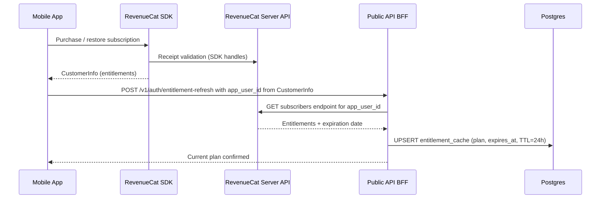

# Architecture Design Note — ARCHITECTURE-20: RevenueCat Entitlement Enforcement

**Product:** CreatorOS v2
**Version:** 1.0
**Date:** 2026-08-23
**Status:** Ready for Development
**Related:** FRS-14-subscription-monetization-v2.md, TDD-03-public-api-bff.md

---

## 1. Purpose

This note defines how CreatorOS enforces plan-based feature limits (Free / Solo / Pro) server-side using RevenueCat, without trusting any client-side entitlement status for authorization decisions.

## 2. Plans and Limits

| Plan | Connected Sources | Active Records | Advanced Search | Receipt Export |
|---|---|---|---|---|
| Free | 2 | 10 | Basic | No |
| Solo ($12 annual / $15 monthly) | Unlimited | Unlimited | Standard | Yes |
| Pro ($20 annual / $24 monthly) | Unlimited | Unlimited | Advanced | Yes |

Limits are enforced by the BFF before accepting mutations. The mobile app may pre-check limits for UX purposes but the BFF is the enforcement point.

## 3. Architecture



## 4. Flow Details

### 4.1 Initial Validation (Login & Upgrade)

1. Mobile completes purchase via RevenueCat SDK.
2. SDK returns `CustomerInfo` containing `originalAppUserId` and entitlement identifiers.
3. Mobile calls a BFF endpoint with the `app_user_id` (never the raw receipt).
4. BFF calls RevenueCat server-to-server GET subscriber endpoint to verify entitlements independently.
5. BFF caches resolved plan in an `entitlement_cache` table keyed by workspace/user with `expires_at = now() + 24 hours`.
6. Subsequent requests read from cache; expired entries trigger revalidation.

### 4.2 Periodic Refresh

- Cache TTL of 24 hours ensures stale entitlements are refreshed at least daily.
- On cache miss or expiry, BFF revalidates against RevenueCat before enforcing limits.

### 4.3 Webhook-Driven Invalidation

- Configure a RevenueCat webhook pointing to a BFF endpoint.
- On `EXPIRED`, `CANCELLED`, `PRODUCT_CHANGE`, or `REFUND` events, BFF deletes or downgrades the cached entry immediately.
- Next request triggers fresh validation against RevenueCat server.

## 5. Enforcement Points

| Limit | Enforcement Location |
|---|---|
| Max connected sources per plan | `POST /connections/oauth/start`: reject if count at limit |
| Max active records per plan | `POST /connected-content`: reject if active count at limit |
| Advanced search features | `GET /search`: filter/sort options gated by plan |
| Receipt export | Export endpoint gated; free tier receives 403 with upgrade code |
| Sync frequency tiers | Rate-limit scheduler reads plan from cached entitlement |

## 6. Error and Edge Cases

| Scenario | Behavior |
|---|---|
| RevenueCat API unavailable during cache refresh | Serve last-known-good cache up to 72h max staleness; log degraded state |
| Cache expired AND RevenueCat unreachable | Default to Free-tier limits (fail-closed for premium features); do not block core local functionality |
| Refund processed via webhook | Immediately downgrade cached plan; existing connected sources beyond new limit become read-only until within limit |
| User cancels but grace period active (Apple/Google policy) | RevenueCat reports entitlement still active during grace period; BFF honors it |
| Sandbox vs production receipts | Separate RevenueCat API keys per environment; never accept sandbox tokens in production |
| Family sharing / promotional grants | Handled by RevenueCat entitlement model transparently; no special BFF logic |
| Multiple devices same user | All devices share same workspace-level cached entitlement |

## 7. Data Model Addition

```sql
CREATE TABLE entitlement_cache (
    workspace_id UUID PRIMARY KEY REFERENCES workspaces(id) ON DELETE CASCADE,
    revenuecat_app_user_id TEXT NOT NULL,
    plan TEXT NOT NULL CHECK (plan IN ('free', 'solo', 'pro')),
    expires_at TIMESTAMPTZ NOT NULL,
    cached_until TIMESTAMPTZ NOT NULL DEFAULT now() + interval '24 hours',
    updated_at TIMESTAMPTZ NOT NULL DEFAULT now()
);
```

## 8. Change Log

| Version | Date | Summary |
|---|---|---|
| 1.0 | 2026-08-23 | Created RevenueCat entitlement enforcement design note. |
