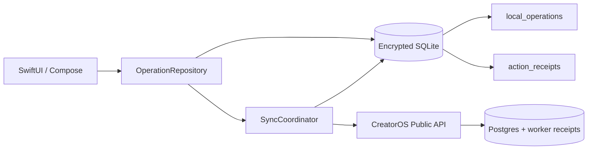
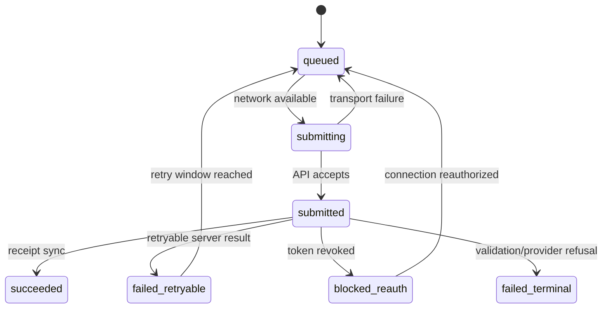
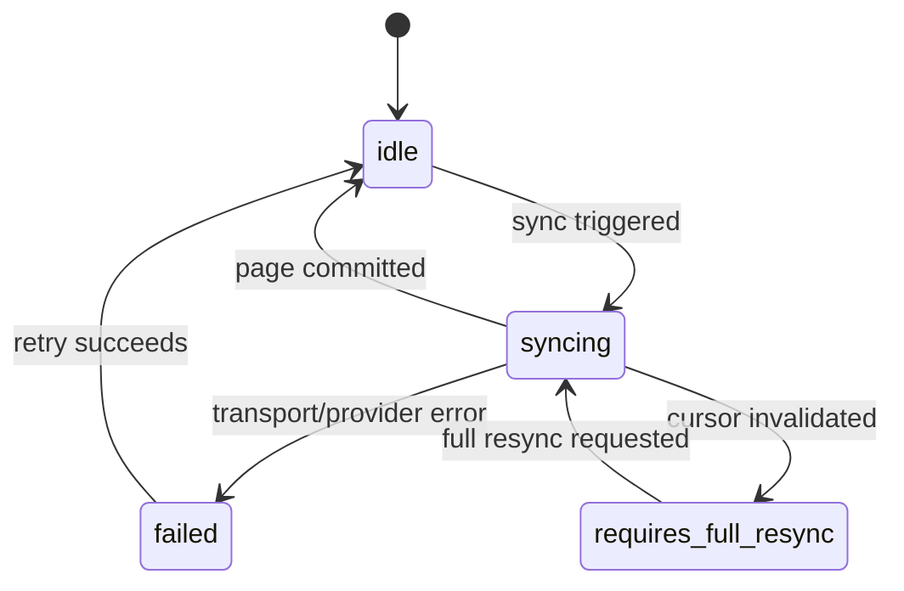

# TDD-02: Offline Sync & Local Operations

- Status: In review
- Owner: Mobile Architect
- Reviewers: Product, Backend, Security
- Created: 2026-08-23
- Last updated: 2026-08-23
- Target release / feature flag: `creatoros.offline_sync.v1`
- Related PRD: `v2/creator_os_prd_v2.md`
- Related API: `v2/api/openapi/creatoros-public.openapi.yaml`
- Related architecture: `v2/architecture/ARCHITECTURE-04-sync-architecture-v2.md`
- ADRs: `v2/architecture/ARCHITECTURE-10-open-decisions-v2.md`

---

## 1. Decision Summary

### Problem

Mobile apps must remain usable offline and must recover safely after process death, network loss, duplicate requests, and ambiguous provider outcomes. User actions that affect provider tools must never be lost or duplicated.

### Proposed Decision

Use a **local action outbox** as the durable command journal. Every user action is persisted as a `LocalOperation` plus a pending `ActionReceipt` in one local SQLite transaction before any network attempt.

Sync is cursor-based for content and receipt-based for operations. The local database is the read source of truth; remote receipts reconcile local provisional state.

### Goals

- Guarantee no loss of user-intended actions after process death or offline periods.
- Guarantee no duplicate provider actions from retries.
- Provide deterministic reconciliation using the same idempotency key across app restarts and server ambiguity.
- Respect platform background constraints on iOS and Android.
- Keep sync observable and recoverable.

### Non-goals

- Real-time sync.
- Multi-device conflict editing.
- Background execution on iOS beyond system-best-effort.
- Raw media synchronization.
- Provider cursor generation on the client.

### Acceptance Criteria

- Given a user action while offline, when the app restarts later, the action remains queued and is submitted when connectivity returns.
- Given an app crash after local enqueue, when the app relaunches, pending operations are discovered and scheduled.
- Given transport failure after a command may have reached the server, when retrying, the same idempotency key is used and no duplicate operation is created.
- Given a remote receipt received before the local submit response is processed, when reconciliation runs, local status matches the remote truth.
- Given invalid OAuth or validation failure, when sync retries, the operation moves to a terminal/blocked state and does not retry indefinitely.
- Given disk full, when sync attempts to write, cursor is not advanced and pending operations are not deleted.

---

## 2. Context and Constraints

### Existing Architecture

Mobile apps use encrypted local SQLite with FTS5. The public BFF accepts idempotent commands and returns operations/receipts. The connector worker executes provider actions and writes receipts. The local database must mirror and reconcile that remote state.

### Constraints

- **iOS:** Background Tasks are system-scheduled best-effort; sync must also run on foreground/network events.
- **Android:** WorkManager supports persistent work, unique work, network constraints, bounded retries.
- **Network:** connectivity may drop mid-request; duplicate delivery is expected.
- **Privacy:** only normalized metadata and minimal command payloads are stored locally; raw media and OAuth tokens are never stored.

### Assumptions

- Server operations and receipts use immutable UUIDs.
- Server idempotency keys are scoped to workspace, actor, and request hash.
- Cursors are opaque and server-issued.
- Local timestamps are integer epoch milliseconds.

---

## 3. Architecture and Ownership

### Context Diagram



### Component Responsibilities

| Component | Owns | Reads | Writes | Must not own |
|---|---|---|---|---|
| iOS app | local outbox, pending state, BGTask scheduling | local DB, API | local DB, API commands | provider token refresh |
| Android app | local outbox, pending state, WorkManager | local DB, API | local DB, API commands | provider token refresh |
| OperationRepository | command journal, receipt projections | local DB | local DB | network transport |
| SyncCoordinator | sync triggering, cursor reconciliation, pending upload | local DB, API | local DB, API | provider execution |
| OutboxUploader | submission of pending operations | API | operation state | deciding terminality |

---

## 4. Domain and State Design

### Domain Objects

| Entity | Fields & Invariants | Owner | Persistence |
|---|---|---|---|
| `LocalOperation` | id, workspaceId, idempotencyKey, operationType, requestJson, requestHash, localStatus, serverOperationId, serverStatus, attemptCount, nextRetryAtMs, timestamps | Mobile | local SQLite |
| `ActionReceipt` | id, workspaceId, operationId, serverReceiptId, provider, providerActionId, status, resultJson, errorCode, errorMessage, occurredAtMs, receivedAtMs | API/Worker | local SQLite |
| `SyncState` | workspaceId, connectionId, streamName, cursor, syncStatus, lastAttemptAtMs, lastSuccessAtMs, lastErrorCode | Mobile | local SQLite |

### Local Operation State Machine



### Sync State Machine



### Invariants

- A pending operation is never deleted before terminal state or explicit user action.
- A receipt is append-only.
- Cursor advances only after the entire page is committed locally.
- Retrying the same command uses the same idempotency key and request hash.
- Local operations may be coalesced for display but never lose historical intent.

---

## 5. End-to-End Data Flow

### Offline Command Submission

1. User confirms action.
2. App generates UUID operation ID and UUID idempotency key.
3. App computes canonical request hash.
4. App inserts `LocalOperation` and pending `ActionReceipt` in one local transaction.
5. UI renders `queued`.
6. SyncCoordinator schedules upload.
7. Network becomes available.
8. OutboxUploader sends command with `Idempotency-Key`.
9. API returns `202` with server operation ID.
10. Local operation updates to `submitted`.
11. Later, receipt sync pulls terminal receipt.
12. Local operation updates to `succeeded` / `failed_*`.

### Transport Ambiguity

If upload times out after the server may have accepted the command:

1. Keep local operation in `submitting`.
2. Do not generate a new idempotency key.
3. Retry with the same key.
4. API returns original operation if already accepted; mobile updates to `submitted`.
5. If API returns `409 IDEMPOTENCY_KEY_REUSED` with different hash, mark terminal and surface conflict.

### Receipt Reconcile

If a remote receipt arrives before local `submitted` state is processed, reconcile by server operation ID and immutable receipt ID. Receipts upsert by `(operation_id, server_receipt_id)`.

---

## 6. Persistence and Search Design

### 6.1 Schema

Use the tables from TDD-01 §6.1. This TDD adds behavior and indexing rules around `local_operations`, `action_receipts`, and `sync_state`.

#### Additional Indexes

```sql
CREATE INDEX local_operations_pending_idx
ON local_operations(local_status, next_retry_at_ms, created_at_ms);

CREATE INDEX action_receipts_operation_idx
ON action_receipts(operation_id, occurred_at_ms DESC);

CREATE INDEX sync_state_connection_idx
ON sync_state(connection_id, stream_name);
```

### 6.2 Search Index Impact

Offline sync does not change FTS search behavior. When content records are inserted/updated by sync, FTS triggers keep the index consistent in the same transaction.

---

## 7. Public and Internal Contracts

### 7.1 Public API Endpoints Used

| Operation | Method / Path | Idempotency | Response |
|---|---|---|---|
| Create handoff | `POST /v1/handoffs` | required | `202 Operation` |
| Get operation | `GET /v1/operations/{id}` | n/a | `200 Operation` |
| List receipts | `GET /v1/connected-content/{recordId}/receipts` | n/a | `200 receipts` |
| Connection sync | `POST /v1/connections/{id}:sync` | required | `202 Operation` |

### 7.2 Outbox Event Contract

Local mobile outbox is not published to BullMQ directly. It is submitted to the public API as a normal command with an idempotency key.

For server-side outbox, refer to `v2/api/cross-cutting/webhooks.md` and `v2/api/cross-cutting/idempotency.md`.

---

## 8. Platform Implementation

### 8.1 iOS

Module structure:

```text
apps/ios/CreatorOS/
├── Core/Sync/
│   ├── SyncCoordinator.swift
│   ├── OutboxUploader.swift
│   └── SyncScheduler.swift
├── Domain/Operations/
│   ├── LocalOperation.swift
│   └── ActionReceipt.swift
├── Data/Operations/
│   ├── LocalOperationStore.swift
│   ├── ActionReceiptStore.swift
│   └── OperationRepositoryGRDB.swift
└── Features/Offline/
    ├── OfflineBannerView.swift
    └── OfflineViewModel.swift
```

Sync triggers:

- On app foreground.
- On network reachability restoration.
- On explicit user refresh.
- BGTask best-effort when system grants time.

Key rules:

- Use `DatabasePool.write` for operation + receipt insertion.
- Use `BGTaskScheduler` with registered identifiers.
- Never perform long network work on the main actor.
- Persist `next_retry_at_ms` before scheduling retry.

### 8.2 Android

Module structure:

```text
apps/android/app/src/main/java/com/creatoros/
├── core/sync/
│   ├── SyncCoordinator.kt
│   ├── OperationUploadWorker.kt
│   ├── ConnectionSyncWorker.kt
│   └── SyncWorkScheduler.kt
├── data/operations/
│   ├── LocalOperationEntity.kt
│   ├── ActionReceiptEntity.kt
│   ├── OperationDao.kt
│   └── RoomOperationRepository.kt
├── domain/operations/
│   ├── OperationRepository.kt
│   └── LocalOperation.kt
└── feature/offline/
    ├── OfflineBanner.kt
    └── OfflineViewModel.kt
```

WorkManager rules:

- Use unique work for operation upload: `creatoros.operation_upload.v1`.
- Use unique work for connection sync: `creatoros.connection_sync.v1:{connectionId}`.
- Constrain to `NetworkType.CONNECTED`.
- Use `ExistingWorkPolicy.KEEP` or `REPLACE` deliberately.
- Return `Result.retry()` only for transient/transport failures.
- Return `Result.success()` for terminal/blocked/validation failures after persisting state.

---

## 9. Failure, Security, and Recovery

### 9.1 Error Taxonomy

| Category | Example | Retry? | User Message |
|---|---|---|---|
| Network transient | timeout, DNS | yes bounded | “Will retry when connected” |
| OAuth invalid | invalid_grant | no until reconnect | “Reconnect provider” |
| Rate limited | 429 | yes provider-aware | “Sync delayed” |
| Validation | unsupported action | no | “Action not supported” |
| Conflict | idempotency hash mismatch | no | “Action conflict; refresh” |

### 9.2 Security and Privacy

- OAuth tokens never stored locally.
- `request_json` may contain user intent but not raw media.
- Idempotency key is not reversible to user content.
- Request hash prevents same-key different-body replay.
- Sync logs never include request bodies or content.

### 9.3 Recovery Rules

- App restart: scan pending operations and schedule upload.
- Keychain/Keystore key loss: discard local DB and resync from backend.
- FTS corruption: rebuild from canonical records; do not lose operations/receipts.
- Disk full: stop sync; do not advance cursor; do not delete pending operations.
- Provider cursor invalidated: mark `requires_full_resync`; trigger full sync.

---

## 10. Observability

### Telemetry fields

```text
pending_operation_count
oldest_pending_operation_ms
sync_cursor_age_ms
sync_failure_code
sync_attempt_count
idempotency_key_hash
receipt_status
database_open_failure_code
background_sync_budget_used
work_manager_attempt_count
```

Do not log:

- OAuth tokens
- Request bodies
- User content
- Raw provider diagnostics
- Full idempotency keys (use hash)

---

## 11. Test Strategy

### 11.1 Testable Invariants

| Invariant | Test Method |
|---|---|
| Operation and pending receipt insert atomically | Kill process after insert; verify both exist |
| Retry uses same idempotency key | Network failure + retry with same key |
| No duplicate operation after ambiguous timeout | Simulate timeout; replay; verify one server op |
| Remote receipt reconciles local state | Inject remote receipt; verify local update |
| Cursor advances only after full page commit | Fake API page; kill mid-page; verify cursor unchanged |
| Failed validation becomes terminal | Fake API 400; verify no automatic retry |
| OAuth invalid becomes blocked_reauth | Fake API 422 `CONNECTION_REAUTH_REQUIRED`; verify state |
| WorkManager/BGTask persistence | Process death + relaunch; verify pending upload scheduled |

### 11.2 Test Matrix

| Layer | iOS | Android |
|---|---|---|
| Operation repository | GRDB transaction tests | Room withTransaction tests |
| Sync coordinator | Fake API cursor/error injection | Same |
| Background scheduling | BGTask/foreground tests | WorkManager TestDriver |
| Recovery | Kill/relaunch during sync | Process death tests |
| Idempotency | Shared contract fixtures | Same |

---

## 12. Open Questions

| Question | Owner | Default |
|---|---|---|
| Should offline banners show pending count? | Product | Yes |
| Should sync run on mobile data? | Product | User-configurable; default Wi-Fi for large sync |
| Should local operations purge after success? | Mobile | Yes, after 30 days |
| Should full resync be automatic on cursor invalid? | Mobile + Backend | Yes, with user-visible progress |

---

## 13. Change Log

| Version | Date | Summary |
|---|---|---|
| 1.0 | 2026-08-23 | Created Offline Sync & Local Operations TDD. |
