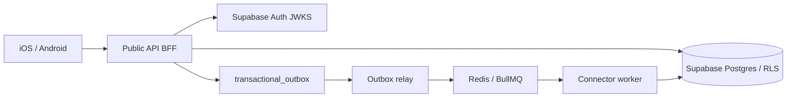
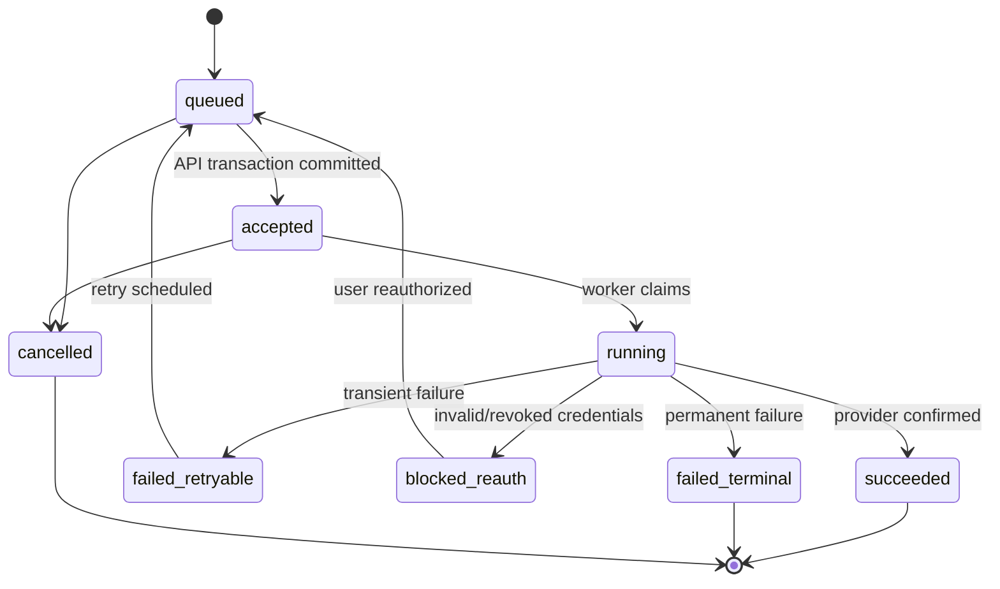
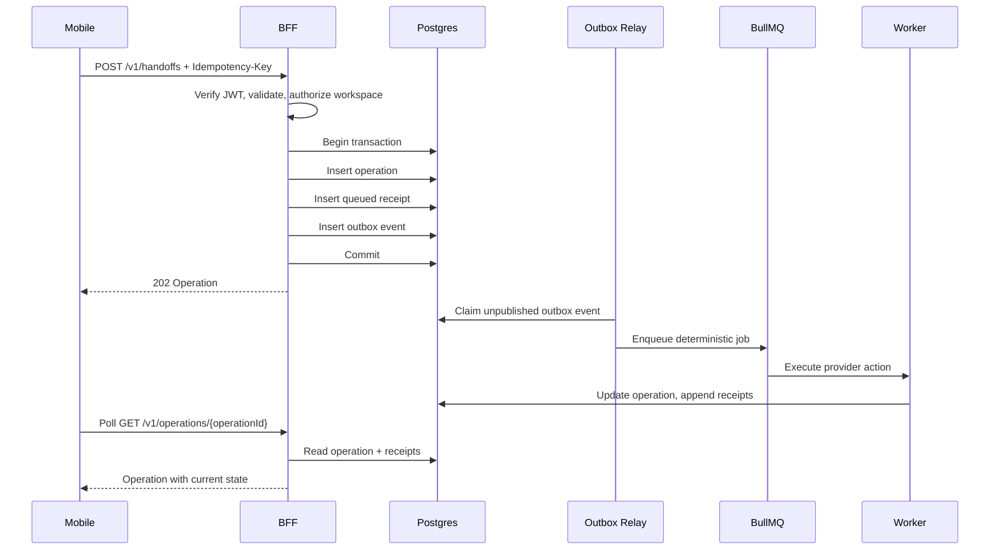

# TDD-03: Public API BFF

- Status: In review
- Owner: Backend Architect
- Reviewers: Mobile, Product, Security
- Created: 2026-08-23
- Last updated: 2026-08-23
- Target release / feature flag: `creatoros.api_bff.v1`
- Related PRD: `v2/creator_os_prd_v2.md`
- Related API: `v2/api/openapi/creatoros-public.openapi.yaml`
- Related architecture: `v2/architecture/ARCHITECTURE-07-backend-and-api-v2.md`
- ADRs: `v2/architecture/ARCHITECTURE-10-open-decisions-v2.md`

---

## 1. Decision Summary

### Problem

Mobile clients need a predictable, secure, and mobile-friendly public API. The API must validate Supabase identity, enforce workspace authorization, shape responses for mobile screens, create durable operations and receipts, and reliably trigger provider work without ever exposing provider tokens or internal queue details.

### Proposed Decision

Build a **Node/TypeScript BFF using Fastify**, contract-first with OpenAPI 3.1. The BFF is the only public API mobile apps call. It:

- Validates Supabase JWTs at the boundary.
- Applies workspace membership and plan checks.
- Returns tailored read models and standardized problem+json errors.
- Requires idempotency keys for mutations.
- Creates `operations`, `action_receipts`, and `transactional_outbox` rows in one Postgres transaction.
- Returns `202 Accepted` for durable provider work.
- Generates TypeScript types from OpenAPI and validates runtime responses in CI.

### Goals

- Single stable public contract for iOS and Android.
- Prevent duplicate provider side effects from mobile retries.
- Keep mobile payloads bounded and screen-oriented.
- Preserve backward compatibility for released mobile versions.
- Maintain a clear boundary between mobile intent and provider execution.

### Non-goals

- Direct provider calls from mobile.
- Exposing provider cursors, tokens, raw payloads, or queue IDs.
- Real-time subscriptions in MVP.
- GraphQL or generic query APIs.
- Bypassing RLS with `service_role` for ordinary user requests.

### Acceptance Criteria

- Given a valid Supabase JWT, when a mobile client calls any endpoint, the BFF validates identity and derives the request principal without trusting user-provided IDs.
- Given a mutating request without an idempotency key, the BFF returns `400 IDEMPOTENCY_KEY_REQUIRED`.
- Given duplicate submission with the same key and same request, the BFF returns the original operation.
- Given duplicate submission with the same key but different request body, the BFF returns `409 IDEMPOTENCY_KEY_REUSED_WITH_DIFFERENT_REQUEST`.
- Given a provider-bound command, the BFF returns `202 Accepted` and never performs provider I/O synchronously.
- Given a provider failure during background execution, the BFF returns a normalized operation state or receipt, never raw provider errors.
- Given invalid request schema, the BFF returns `application/problem+json` with field-level details.
- Given an unauthenticated request, the BFF returns `401` without hitting business services.
- Given a request for an inaccessible workspace, the BFF returns `403 WORKSPACE_ACCESS_DENIED`.

---

## 2. Context and Constraints

### Existing Architecture

CreatorOS uses Supabase Auth + Postgres/RLS. The connector worker executes provider actions. Mobile apps never call providers directly. The BFF sits between mobile and the durable backend and is the only public HTTP API.

### Constraints

- OpenAPI 3.1 is the public contract source of truth.
- All mutations require idempotency keys.
- Long-running or provider-affecting work returns `202`.
- Mobile responses must be small, paginated, and stable.
- Caching for authenticated data must be `private`.
- Supabase `service_role` must never be shipped to mobile.
- Provider credentials remain only in the connector service.

### Assumptions

- Supabase JWTs use asymmetrical keys with a JWKS endpoint.
- Node/TypeScript version supports recent Fastify releases.
- Postgres supports transactional outbox with `SKIP LOCKED`.
- BullMQ/Redis is available for durable job delivery.
- The BFF and worker share schema-only contracts, not business classes.

---

## 3. Architecture and Ownership

### Context Diagram



### Component Responsibilities

| Component | Owns | Reads | Writes | Must not own |
|---|---|---|---|---|
| Route layer | HTTP contract, input parsing, response mapping | request state | HTTP responses | business logic |
| Auth plugin | JWT validation, request principal | Supabase JWKS | request principal | provider tokens |
| Command services | use-case authorization, validation, transactional writes | DB | operations, receipts, outbox | provider API calls |
| Query services | mobile read models, cache policy, cursor pagination | DB | no writes | provider API calls |
| Repository layer | database SQL/query implementation | DB | DB | HTTP objects |
| Outbox relay | publishing outbox events to queue | DB | DB + queue | domain correctness |

---

## 4. Domain and State Design

### Domain Objects

| Entity | Fields & Invariants | Owner | Persistence |
|---|---|---|---|
| `Operation` | id, workspaceId, connectionId, actorUserId, idempotencyKey, operationType, requestHash, requestJson, status, attemptCount, timestamps; unique `(workspace_id, actor_user_id, idempotency_key)` | API | Postgres |
| `ActionReceipt` | id, workspaceId, operationId, sequenceNo, status, provider, providerActionId, eventType, resultJson, errorCode, errorMessage, occurredAtMs | API/Worker | Postgres |
| `TransactionalOutboxEvent` | id, aggregateType, aggregateId, eventType, schemaVersion, payload, availableAt, publishedAt, attempts | API | Postgres |
| `IdempotencyRecord` | workspaceId, actorUserId, method, routeTemplate, idempotencyKey, requestHash, responseStatus, responseBody, operationId, receiptId | API | Postgres |

### Operation State Machine



### Receipt Model

Receipts are append-only. Current operation status is a projection from the latest valid receipt/status transition.

Receipt event types:

- `operation.queued`
- `operation.accepted`
- `operation.started`
- `operation.retry_scheduled`
- `operation.blocked_reauth`
- `operation.succeeded`
- `operation.failed_terminal`
- `operation.cancelled`

---

## 5. End-to-End Data Flow

### Primary Command Sequence



### Offline Mobile Interaction

Mobile creates a local pending operation before network transport. When connectivity returns, it submits the same command and idempotency key. The BFF returns the original operation on replay.

---

## 6. Persistence and Search Design

### 6.1 Postgres Schema

```sql
CREATE TYPE operation_status AS ENUM (
  'queued',
  'accepted',
  'running',
  'succeeded',
  'failed_retryable',
  'failed_terminal',
  'blocked_reauth',
  'cancelled'
);

CREATE TABLE operations (
  id UUID PRIMARY KEY,
  workspace_id UUID NOT NULL,
  connection_id UUID,
  actor_user_id UUID NOT NULL,
  idempotency_key UUID NOT NULL,
  operation_type TEXT NOT NULL,
  request_hash TEXT NOT NULL,
  request_json JSONB NOT NULL,
  status operation_status NOT NULL DEFAULT 'queued',
  attempt_count INTEGER NOT NULL DEFAULT 0,
  next_attempt_at TIMESTAMPTZ,
  provider_operation_id TEXT,
  failure_code TEXT,
  failure_message TEXT,
  created_at TIMESTAMPTZ NOT NULL DEFAULT now(),
  updated_at TIMESTAMPTZ NOT NULL DEFAULT now(),
  UNIQUE (workspace_id, actor_user_id, idempotency_key)
);

CREATE TABLE action_receipts (
  id UUID PRIMARY KEY,
  workspace_id UUID NOT NULL,
  operation_id UUID NOT NULL REFERENCES operations(id),
  sequence_no INTEGER NOT NULL,
  status operation_status NOT NULL,
  provider TEXT,
  provider_action_id TEXT,
  event_type TEXT NOT NULL,
  result_json JSONB,
  error_code TEXT,
  error_message TEXT,
  occurred_at TIMESTAMPTZ NOT NULL,
  created_at TIMESTAMPTZ NOT NULL DEFAULT now(),
  UNIQUE (operation_id, sequence_no)
);

CREATE TABLE transactional_outbox (
  id UUID PRIMARY KEY,
  aggregate_type TEXT NOT NULL,
  aggregate_id UUID NOT NULL,
  event_type TEXT NOT NULL,
  schema_version INTEGER NOT NULL,
  payload JSONB NOT NULL,
  available_at TIMESTAMPTZ NOT NULL DEFAULT now(),
  published_at TIMESTAMPTZ,
  publish_attempt_count INTEGER NOT NULL DEFAULT 0,
  locked_at TIMESTAMPTZ,
  locked_by TEXT,
  last_error_code TEXT,
  created_at TIMESTAMPTZ NOT NULL DEFAULT now()
);

CREATE INDEX transactional_outbox_unpublished_idx
ON transactional_outbox (available_at, created_at)
WHERE published_at IS NULL;

CREATE TABLE api_idempotency_keys (
  id BIGSERIAL PRIMARY KEY,
  workspace_id UUID NOT NULL,
  actor_user_id UUID NOT NULL,
  method TEXT NOT NULL,
  route_template TEXT NOT NULL,
  idempotency_key TEXT NOT NULL,
  request_hash TEXT NOT NULL,
  response_status INTEGER,
  response_body JSONB,
  operation_id UUID,
  receipt_id UUID,
  state TEXT NOT NULL,
  created_at TIMESTAMPTZ NOT NULL DEFAULT now(),
  expires_at TIMESTAMPTZ NOT NULL,
  UNIQUE (workspace_id, actor_user_id, method, route_template, idempotency_key)
);
```

### 6.2 Indexes and Constraints

- `operations` unique index on `(workspace_id, actor_user_id, idempotency_key)`.
- `action_receipts` unique index on `(operation_id, sequence_no)`.
- `transactional_outbox` partial index for unpublished events.
- `api_idempotency_keys` unique index on `(workspace_id, actor_user_id, method, route_template, idempotency_key)`.

---

## 7. Public and Internal Contracts

### 7.1 OpenAPI Workflow

Use `v2/api/openapi/creatoros-public.openapi.yaml` as the source of truth.

CI must:

1. Lint and bundle OpenAPI.
2. Generate TypeScript types/client.
3. Compile iOS/Android generated clients.
4. Run BFF response contract tests.
5. Run backward-compatibility diff.
6. Reject breaking changes unless new API version.

### 7.2 Error Format

Use RFC 9457 `application/problem+json` with extensions:

```json
{
  "type": "https://creatoros.app/errors/rate_limited",
  "title": "Rate limited",
  "status": 429,
  "code": "RATE_LIMITED",
  "requestId": "req_01JQ...",
  "detail": "Too many search requests. Try again shortly.",
  "retryAfterSeconds": 20
}
```

---

## 8. Platform Implementation

### 8.1 Node/TypeScript Structure

```text
apps/api/src/
├── app.ts
├── server.ts
├── config/
├── plugins/
│   ├── auth.ts
│   ├── request-context.ts
│   ├── error-handler.ts
│   ├── validation.ts
│   ├── caching.ts
│   └── observability.ts
├── modules/
│   ├── content/
│   ├── search/
│   ├── connections/
│   ├── operations/
│   └── handoffs/
├── persistence/
│   ├── ContentRepository.ts
│   ├── ConnectionRepository.ts
│   ├── OperationRepository.ts
│   ├── ReceiptRepository.ts
│   ├── OutboxRepository.ts
│   └── IdempotencyRepository.ts
└── lib/
    ├── cursor.ts
    ├── etag.ts
    └── canonical-json.ts
```

### 8.2 Auth Plugin

- Use cached JWKS for Supabase JWT verification.
- For session-sensitive endpoints, call Supabase Auth `getUser()`.
- Derive `Principal` from validated JWT.
- Never trust `user_id` or `workspace_id` from request body for authorization.

---

## 9. Failure, Security, and Recovery

### 9.1 Error Mapping

| Source | HTTP | Code | Retry |
|---|---|---|---|
| Missing token | 401 | `AUTHENTICATION_REQUIRED` | No |
| Invalid JWT | 401 | `INVALID_ACCESS_TOKEN` | No |
| No workspace access | 403 | `WORKSPACE_ACCESS_DENIED` | No |
| Invalid schema | 400 | `VALIDATION_FAILED` | Fix input |
| Semantic invalid command | 422 | `HANDOFF_NOT_SUPPORTED` | No |
| Idempotency conflict | 409 | `IDEMPOTENCY_KEY_REUSED_WITH_DIFFERENT_REQUEST` | No |
| Reauth required | 422 | `CONNECTION_REAUTH_REQUIRED` | Reconnect |
| Rate limited | 429 | `RATE_LIMITED` | Respect Retry-After |
| Internal error | 500 | `INTERNAL_ERROR` | Safe retry with same key |

### 9.2 Idempotency and Durable Execution

- API validates idempotency key and request hash before command.
- Domain mutation and outbox insert happen in one transaction.
- Worker job IDs derive from durable outbox IDs.
- Retries are safe through idempotency and reconciliation.

### 9.3 Security and Privacy

- Never log bearer tokens, request bodies, raw provider data, or user content.
- Use `Cache-Control: private` for authenticated responses.
- Use ETags for detail endpoints where caching is appropriate.
- Never use `service_role` for ordinary mobile requests.

---

## 10. Observability

### Telemetry fields

```text
request_id
operation_id
idempotency_key_hash
workspace_id
connection_id
provider
status_code
error_code
latency_ms
```

Do not log:

- Supabase tokens
- Provider tokens
- Request JSON bodies
- Raw provider errors
- User content

---

## 11. Test Strategy

### 11.1 Testable Invariants

| Invariant | Test Method |
|---|---|
| OpenAPI response matches runtime schemas | Contract test against Fastify inject |
| Duplicate command returns original operation | Idempotency replay test |
| Same key different body returns conflict | Hash mismatch test |
| Outbox event committed with operation atomically | Transaction kill test |
| RLS blocks cross-workspace access | RLS integration test |
| Error format matches problem+json | Error schema test |
| Generated clients compile | CI build steps |

### 11.2 Test Matrix

| Layer | Tests |
|---|---|
| Route | OpenAPI response validation, auth, validation |
| Service | Authorization, idempotency, transaction |
| Repository | RLS, queries, constraints |
| Outbox | Claim/publish/retry |
| Contract | Generated client + mock server |

---

## 12. Open Questions

| Question | Owner | Default |
|---|---|---|
| Should BFF and worker share a monorepo package for error codes? | Backend | Yes |
| Should search responses include snippets? | Product | Yes, title-focused |
| Should all BFF endpoints be behind one Supabase project? | Backend | Yes |
| Should BFF use direct Postgres connection or Supabase client? | Backend | Direct connection with RLS-aware transaction |

---

## 13. Change Log

| Version | Date | Summary |
|---|---|---|
| 1.0 | 2026-08-23 | Created Public API BFF TDD. |
