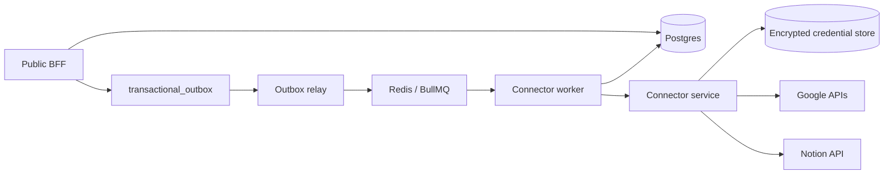
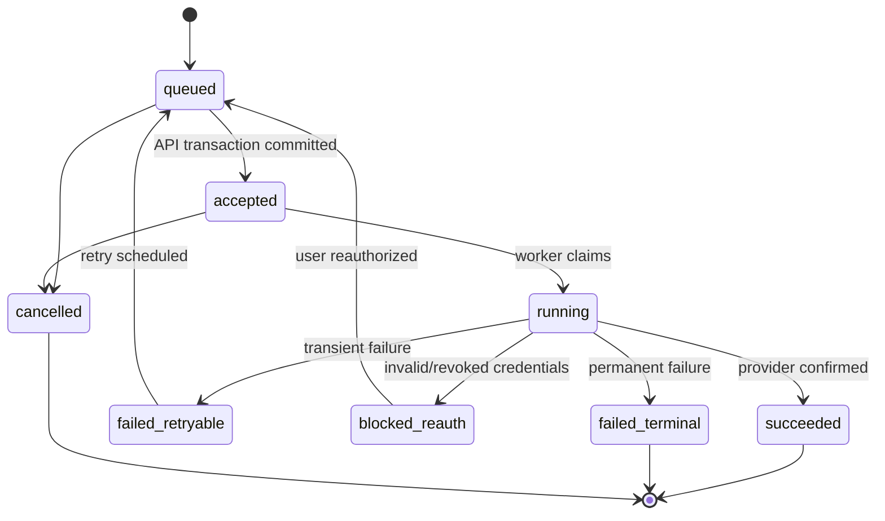
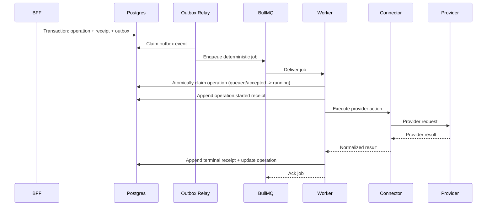

# TDD-04: Connector Worker & Durable Operations

- Status: In review
- Owner: Backend Architect
- Reviewers: Mobile, Product, Security
- Created: 2026-08-23
- Last updated: 2026-08-23
- Target release / feature flag: `creatoros.connector_worker.v1`
- Related PRD: `v2/creator_os_prd_v2.md`
- Related API: `v2/api/openapi/creatoros-public.openapi.yaml`
- Related architecture: `v2/architecture/ARCHITECTURE-15-backend-connector-service-v2.md`
- ADRs: `v2/architecture/ARCHITECTURE-10-open-decisions-v2.md`

---

## 1. Decision Summary

### Problem

Provider-bound actions are asynchronous, unreliable, and rate-limited. The mobile app cannot reliably wait for Google/Notion requests, and a naive retry can create duplicate external side effects. CreatorOS needs a durable execution layer that survives worker crashes, queue redelivery, provider outages, and ambiguous outcomes.

### Proposed Decision

Build a **dedicated Node/TypeScript connector worker** that consumes jobs from BullMQ. The worker treats all provider-affecting jobs as **at-least-once** execution. Postgres is the source of truth for operation and receipt state. A transactional outbox guarantees that no durable command is lost between the BFF transaction and queue publishing.

The worker:

- Claims operations atomically.
- Records receipt transitions.
- Applies provider-specific idempotency and reconciliation before non-idempotent writes.
- Uses per-connection locks for token refresh and cursor movement.
- Normalizes provider errors and applies retry classification.
- Uses provider-aware rate limiting and backoff.

### Goals

- Guarantee every accepted command is eventually attempted.
- Guarantee no duplicate provider side effect from duplicate job delivery.
- Maintain immutable, append-only receipts for user-visible audit.
- Handle worker crashes, Redis outages, provider throttling, and token revocation without losing intent or duplicating actions.
- Keep queue payloads small and pointer-based; reload authoritative state from Postgres.

### Non-goals

- Real-time execution.
- Direct provider calls from mobile.
- Exposing queue IDs, provider cursors, or tokens to mobile.
- Implementing a general workflow engine.
- Replacing BullMQ with a custom durable scheduler.
- Treating BullMQ as the source of truth.

### Acceptance Criteria

- Given an accepted operation, when the BFF commits the transaction, an outbox event exists and is eventually published to BullMQ.
- Given duplicate outbox publishing, when the worker receives duplicate jobs, only one provider action is performed.
- Given a worker crash after provider success but before receipt write, when the job retries, the worker reconciles the provider result and writes a single success receipt.
- Given provider `429`, when the worker handles the failure, the job is delayed according to `Retry-After` and does not burn normal retry attempts.
- Given token revocation, when the worker receives `401/invalid_grant`, the operation moves to `blocked_reauth` and automatic retries stop.
- Given provider `400 validation`, when the worker processes the failure, the operation moves to `failed_terminal` without further retries.
- Given Redis outage, when outbox publishing fails, the outbox event remains unpublished and is retried later.
- Given a non-idempotent provider write timeout, when the worker recovers, it reconciles before attempting a second write.

---

## 2. Context and Constraints

### Existing Architecture

The public BFF writes operations, receipts, and outbox events transactionally. The connector worker consumes BullMQ jobs. Provider adapters normalize Google Drive/Docs/Calendar and Notion APIs. Mobile apps poll operations and receipts.

### Constraints

- BullMQ + Redis are used for job delivery, not durable business state.
- Provider APIs have different idempotency capabilities.
- OAuth tokens live only in the connector service.
- Provider rate limits are per-project, per-user/connection, or per-workspace.
- Google/Notion webhooks are hints and require cursor-based reconciliation.
- Worker concurrency and lock durations must be tuned for provider variability.

### Assumptions

- BullMQ is configured with reliable Redis.
- Each worker process can access the same Postgres.
- Operation IDs and outbox event IDs are UUIDs.
- Provider adapters return normalized `ProviderError` types.
- All timestamps use ISO 8601 in Postgres/JSON.

---

## 3. Architecture and Ownership

### Context Diagram



### Component Responsibilities

| Component | Owns | Reads | Writes | Must not own |
|---|---|---|---|---|
| Outbox relay | publishing outbox events | Postgres outbox | BullMQ | provider execution |
| Connector worker | job execution, retry classification, locks | BullMQ, Postgres | operations, receipts | provider API design |
| Connector service | OAuth refresh, provider client factory, adapter invocation | credential store | encrypted tokens | domain transactions |
| Provider adapter | request/response mapping, error normalization | provider API | no direct DB | queue semantics |
| Receipt writer | append-only receipt transitions | operation state | receipts | provider execution |

---

## 4. Domain and State Design

### Domain Objects

| Entity | Fields & Invariants | Owner | Persistence |
|---|---|---|---|
| `Operation` | id, workspaceId, connectionId, actorUserId, idempotencyKey, operationType, requestHash, requestJson, status, attemptCount, nextAttemptAt, providerOperationId, failureCode, failureMessage | API/Worker | Postgres |
| `ActionReceipt` | id, operationId, sequenceNo, status, provider, providerActionId, eventType, resultJson, errorCode, errorMessage, occurredAt | Worker | Postgres |
| `OutboxEvent` | id, aggregateType, aggregateId, eventType, schemaVersion, payload, availableAt, publishedAt, attempts | API/Relay | Postgres |
| `ConnectionCredential` | connectionId, encryptedAccessToken, encryptedRefreshToken, expiresAt, version | Connector | Encrypted store |
| `SyncState` | connectionId, streamName, cursor, status, lastAttemptAt, lastSuccessAt, lastErrorCode | Worker | Postgres |

### Operation State Machine



### Receipt Model

Receipts are append-only. Each event:

- `operation.queued`
- `operation.accepted`
- `operation.started`
- `operation.retry_scheduled`
- `operation.blocked_reauth`
- `operation.succeeded`
- `operation.failed_terminal`
- `operation.cancelled`

---

## 5. End-to-End Data Flow

### Primary Execution Sequence



### Retry After Failure

1. Worker classifies `ProviderError`.
2. If retryable, writes `failed_retryable` and `operation.retry_scheduled`.
3. Schedules next attempt time.
4. Throws to BullMQ with delay.
5. If terminal, writes `failed_terminal` and acks job.

### Ambiguous Outcome Recovery

If provider request timed out after possible acceptance:

1. Do not immediately write terminal failure.
2. Attempt provider-side reconciliation using correlation markers.
3. If found, write success receipt.
4. If not found and safe to retry, retry.
5. If uncertain, mark internal `unknown_outcome` and schedule reconciliation job.

---

## 6. Persistence and Search Design

### 6.1 Postgres Schema

Use the schema from TDD-03 §6.1. This TDD adds worker-specific tables:

```sql
CREATE TABLE connector_job_state (
  job_id TEXT PRIMARY KEY,
  operation_id UUID NOT NULL REFERENCES operations(id),
  provider TEXT NOT NULL,
  status TEXT NOT NULL CHECK (
    status IN ('pending', 'running', 'succeeded', 'failed', 'cancelled')
  ),
  attempts INTEGER NOT NULL DEFAULT 0,
  next_attempt_at TIMESTAMPTZ,
  locked_at TIMESTAMPTZ,
  locked_by TEXT,
  created_at TIMESTAMPTZ NOT NULL DEFAULT now(),
  updated_at TIMESTAMPTZ NOT NULL DEFAULT now()
);

CREATE TABLE repair_cases (
  id UUID PRIMARY KEY,
  operation_id UUID NOT NULL REFERENCES operations(id),
  category TEXT NOT NULL,
  provider TEXT NOT NULL,
  error_code TEXT NOT NULL,
  safe_error_summary TEXT NOT NULL,
  status TEXT NOT NULL,
  created_at TIMESTAMPTZ NOT NULL DEFAULT now(),
  resolved_at TIMESTAMPTZ
);
```

### 6.2 Indexes

- `connector_job_state` index on `(provider, status, next_attempt_at)`.
- `repair_cases` index on `(status, created_at)`.

---

## 7. Public and Internal Contracts

### 7.1 Queue Contracts

Use versioned, minimal payloads. Full details in `packages/contracts/src/jobPayloads.ts`.

Example queue names:

```text
creatoros.outbox-relay.v1
creatoros.handoff-execution.v1
creatoros.connection-sync.v1
creatoros.webhook-reconciliation.v1
creatoros.subscription-maintenance.v1
creatoros.receipt-reconciliation.v1
creatoros.dead-letter.v1
```

### 7.2 Job Payload Rules

- Use `schemaVersion`.
- Include `operationId`, `outboxEventId`, `connectionId`, `webhookInboxId` as references.
- Never include OAuth tokens, raw provider payloads, or full user content.
- Use deterministic job IDs.

---

## 8. Platform Implementation

### 8.1 Worker Structure

```text
apps/worker/src/
├── bootstrap.ts
├── queues/
│   ├── queueNames.ts
│   ├── queueFactory.ts
│   └── jobContracts.ts
├── processors/
│   ├── ExecuteHandoffProcessor.ts
│   ├── ConnectionSyncProcessor.ts
│   ├── ReceiptReconciliationProcessor.ts
│   ├── WebhookReconcileProcessor.ts
│   ├── SubscriptionRenewalProcessor.ts
│   └── OutboxRelayProcessor.ts
├── scheduling/
│   ├── ProviderRateLimiter.ts
│   ├── ConnectionLock.ts
│   └── BackoffPolicy.ts
├── persistence/
│   ├── OperationRepository.ts
│   ├── ReceiptRepository.ts
│   ├── OutboxRepository.ts
│   ├── SyncStateRepository.ts
│   └── WebhookInboxRepository.ts
└── observability/
    ├── logger.ts
    ├── metrics.ts
    └── tracing.ts
```

### 8.2 Worker Claim

Use an atomic SQL claim:

```sql
UPDATE operations
SET status = 'running',
    attempt_count = attempt_count + 1,
    updated_at = now()
WHERE id = $1
  AND status IN ('queued', 'accepted', 'failed_retryable')
RETURNING *;
```

If no row is returned, do not process the job.

### 8.3 Retry Policy

Default:

- Handoff: 12 attempts, exponential backoff from 10s
- Incremental sync: 10 attempts, exponential backoff from 30s
- Full resync: 6 attempts, exponential backoff from 60s
- Webhook reconciliation: 8 attempts, exponential backoff from 5s

Non-retryable:

- `TOKEN_REVOKED`
- `ACCESS_REVOKED`
- `VALIDATION_ERROR`
- `UNSUPPORTED_OPERATION`
- Permanent `PERMANENT_PROVIDER_FAILURE`

---

## 9. Failure, Security, and Recovery

### 9.1 Failure Handling Matrix

| Failure | Worker Action | Operation State | BullMQ |
|---|---|---|---|
| Network timeout before request leaves process | Retry same operation | failed_retryable | Retry |
| Timeout after possible acceptance | Reconcile before repeat | confirmation_pending | Delayed reconciliation |
| Provider 429 | Persist throttle, delay | failed_retryable | Delay |
| Google/Notion 401/invalid_grant | Mark connection reauth_required | blocked_reauth | Complete job |
| Provider 400 validation | Preserve safe error | failed_terminal | Complete job |
| Provider 404 target removed | Reconcile deletion | terminal or success | No blind retry |
| Redis outage | Outbox remains unpublished | queued | Relay retries later |
| DB outage after provider success | Reconcile by external ID | confirmation_pending | Retry/reconcile |
| Duplicate webhook | Inbox unique constraint | unchanged | No second job |

### 9.2 Security and Privacy

- Provider tokens never in job payloads, logs, or metrics.
- Worker decrypts tokens only just before provider calls.
- Job payloads contain IDs only.
- Repair cases store safe summaries, not raw provider errors.
- Receipts may contain safe URLs/excerpts, never tokens.

---

## 10. Observability

### Metrics

| Metric | Dimensions | Alert |
|---|---|---|
| `connector_job_duration_seconds` | provider, job type, outcome | p95 threshold |
| `connector_job_failures_total` | provider, code, retryable | error-rate alert |
| `outbox_oldest_pending_seconds` | event type | backlog alert |
| `connector_rate_limited_total` | provider, scope | throttle pressure |
| `connection_reauth_required_total` | provider | revocation wave |
| `sync_cursor_age_seconds` | provider | freshness |
| `unknown_provider_outcome_total` | provider, action type | high severity |

### Correlation IDs

```text
request_id
trace_id
correlation_id
causation_id
workspace_id
connection_id
operation_id
receipt_id
outbox_event_id
bullmq_job_id
webhook_inbox_id
provider
provider_request_id
credential_version
```

---

## 11. Test Strategy

### 11.1 Testable Invariants

| Invariant | Test Method |
|---|---|
| Outbox event committed with operation atomically | Transaction kill test |
| Duplicate job does not duplicate provider action | Idempotent processor test |
| Worker crash after provider success reconciles | Fault injection |
| Provider 429 delays job without burning normal attempts | Rate-limit test |
| Token revocation stops retries | OAuth invalid grant test |
| Validation failure is terminal | Permanent failure test |
| Queue payload does not contain tokens/content | Schema/payload test |
| Connection lock prevents concurrent refresh | Lock concurrency test |

### 11.2 Test Matrix

| Layer | Tests |
|---|---|
| Processor | claim, idempotency, reconciliation |
| Outbox relay | claim/publish/retry |
| Rate limiter | token buckets, Retry-After |
| Credential lock | concurrent refresh |
| Repair | DLQ path, manual replay |
| Provider | sanitized fixtures, sandbox |

---

## 12. Open Questions

| Question | Owner | Default |
|---|---|---|
| Should full resync concurrency be 2? | Backend | Yes |
| Should handoff concurrency be 10? | Backend | Start with 10, tune |
| Should unknown-outcome jobs page on-call? | Backend | Yes |
| Should BullMQ retry handle all transient failures? | Backend | Yes, but receipt state controls terminality |

---

## 13. Change Log

| Version | Date | Summary |
|---|---|---|
| 1.0 | 2026-08-23 | Created Connector Worker & Durable Operations TDD. |
