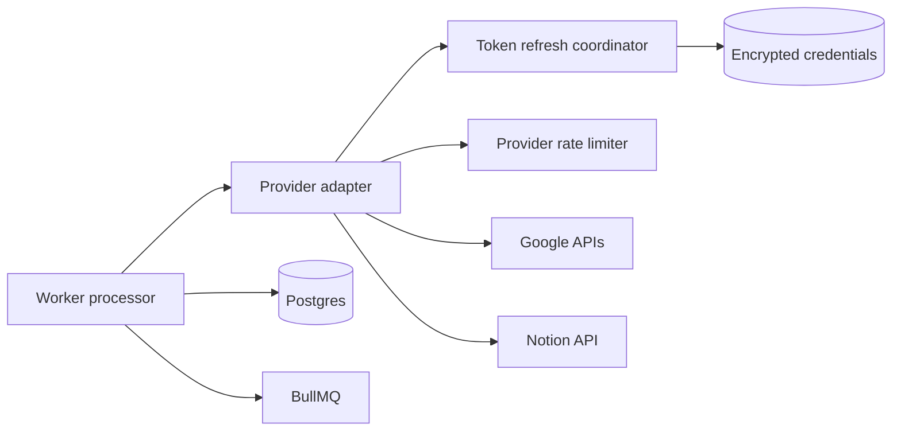
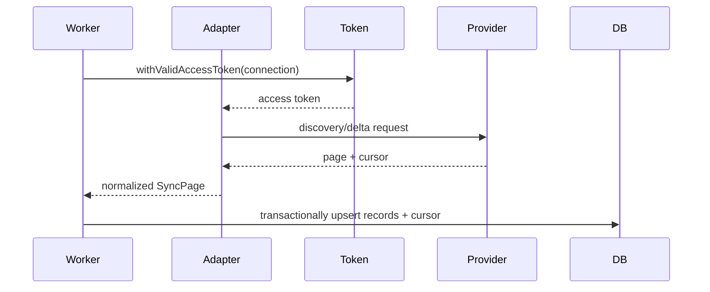
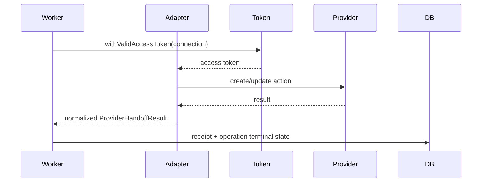

# TDD-05: Provider Adapter Framework

- Status: In review
- Owner: Backend Architect
- Reviewers: Mobile, Product, Security
- Created: 2026-08-23
- Last updated: 2026-08-23
- Target release / feature flag: `creatoros.provider_adapter.v1`
- Related PRD: `v2/creator_os_prd_v2.md`
- Related API: `v2/api/openapi/creatoros-public.openapi.yaml`
- Related architecture: `v2/architecture/ARCHITECTURE-13-connector-architecture-v2.md`
- ADRs: `v2/architecture/ARCHITECTURE-10-open-decisions-v2.md`

---

## 1. Decision Summary

### Problem

Google Drive, Google Docs, Google Calendar, and Notion each have different APIs, pagination models, sync mechanisms, rate limits, OAuth semantics, and webhook behaviors. CreatorOS needs a consistent way to discover, sync, search, and hand off content without leaking provider quirks into the rest of the product.

### Proposed Decision

Use a **capability-based provider adapter framework**.

Each provider implements only the capabilities it actually supports. Adapters return normalized CreatorOS records, opaque cursors, typed errors, and external request IDs. They never directly write business state, queues, receipts, or transactions. The worker orchestrates adapter execution and persists results.

### Goals

- Isolate provider-specific API details behind a stable internal contract.
- Keep adapters replaceable and testable.
- Normalize provider errors into one consistent taxonomy.
- Support discovery, delta sync, full resync, search, and explicit handoffs where applicable.
- Preserve provider object IDs and stable metadata for reconciliation.
- Keep raw provider payloads away from the rest of the system.

### Non-goals

- A uniform adapter that claims every provider supports every capability.
- Direct mobile access to provider APIs.
- Storing raw provider media or tokens.
- Business transaction ownership inside adapters.
- Full CRUD on every provider object.
- Provider webhook handlers doing synchronous API work.

### Acceptance Criteria

- Given a provider adapter invocation, when the provider succeeds, the adapter returns a normalized `ProviderResult` with records/result and provider request ID.
- Given a provider failure, when the adapter catches it, it returns a typed `ProviderError` with normalized code and safe message.
- Given an unsupported capability, when the worker calls the adapter, it returns `UNSUPPORTED_OPERATION` rather than throwing an unknown error.
- Given a paginated response, when the adapter receives a page cursor, it returns that cursor unchanged and opaque.
- Given a provider write timeout, when the worker retries, the adapter exposes reconciliation hooks or correlation IDs for ambiguity resolution.
- Given a provider 429, when the adapter normalizes it, the result includes `RATE_LIMITED` and `retryAfterMs` where available.

---

## 2. Context and Constraints

### Existing Architecture

The connector worker consumes durable jobs and calls the connector service. The connector service owns OAuth and provider clients. Adapters sit inside the connector service and are called only by the worker orchestration layer.

### Constraints

- Provider tokens are encrypted and owned by the connector service.
- Google APIs use project and per-user quota dimensions.
- Notion uses per-connection and per-workspace rate limits.
- Drive and Calendar have native incremental cursor models.
- Docs is discovered through Drive and hydrated explicitly.
- Notion is webhook-first with overlapping timestamp repair.
- Raw media is never uploaded or persisted.

### Assumptions

- Provider client factories are version-pinned.
- Adapters are built around per-connection metadata.
- All adapter results are normalized before worker persistence.
- OAuth refresh happens before provider calls via a token coordinator.

---

## 3. Architecture and Ownership

### Context Diagram



### Component Responsibilities

| Component | Owns | Reads | Writes | Must not own |
|---|---|---|---|---|
| Worker processor | claim, orchestration, receipts, retries | DB, queues, adapters | operations, receipts | provider API detail |
| Token coordinator | refresh, credential rotation | encrypted store | encrypted tokens | business outcomes |
| Provider rate limiter | admission control, throttle | provider budgets | budget state | provider data |
| Provider adapter | provider request/response mapping | provider APIs | no direct DB | business transactions |
| Provider error normalizer | typed errors | provider responses | normalized errors | user-visible state |

---

## 4. Domain and State Design

### Domain Objects

| Entity | Fields & Invariants | Owner | Persistence |
|---|---|---|---|
| `ProviderConnection` | id, workspaceId, provider, providerAccountId, credentialVersion, capabilities | API | Postgres |
| `NormalizedContentRecord` | provider, providerObjectId, providerParentId, providerVersion, recordType, title, canonicalUrl, normalizedText, authorName, createdAt, modifiedAt, deleted, metadata | Adapter/Worker | Postgres/mobile |
| `SyncPage` | records, nextPageCursor, nextDeltaCursor, hasMore, requiresFullResync | Adapter | No direct persistence |
| `ProviderError` | provider, code, retryable, retryAfterMs, providerStatus, providerRequestId, safeMessage, diagnostics | Adapter | Worker |
| `ProviderHandoffResult` | providerActionId, providerVersion, outcome, providerRequestId | Adapter/Worker | Worker |

### Provider Error Codes

- `AUTH_REQUIRED`
- `TOKEN_REVOKED`
- `RATE_LIMITED`
- `TEMPORARY_PROVIDER_FAILURE`
- `PERMANENT_PROVIDER_FAILURE`
- `NOT_FOUND`
- `ACCESS_REVOKED`
- `CONFLICT`
- `CURSOR_INVALID`
- `VALIDATION_ERROR`
- `UNSUPPORTED_OPERATION`
- `UNKNOWN_OUTCOME`

### State Machine

Adapter invocation itself does not have an independent state machine. It returns either `ok: true` or `ok: false`. The worker maps results to operation/receipt states.

---

## 5. End-to-End Data Flow

### Discovery / Sync Flow



### Handoff Flow



---

## 6. Persistence and Search Design

### 6.1 Adapter Persistence Rules

Adapters do not persist directly. They return normalized data. Worker persistence follows TDD-04.

Provider-specific retention:

- Drive change cursors are stored per connection.
- Calendar sync tokens are stored per `(connection_id, calendar_id)`.
- Notion uses webhook watermark and overlapping repair cursor.
- Docs uses Drive version/modified time for rehydration decisions.

### 6.2 Search Index Impact

Normalized records returned by adapters flow into the Postgres/mobile FTS index. Adapters must ensure `normalizedText` is sanitized and truncated before returning.

---

## 7. Public and Internal Contracts

### 7.1 Adapter Interface

Use the shared adapter contract from `packages/contracts/src/providers.ts`:

```ts
export interface ProviderAdapter {
  readonly provider: Provider;

  discover(input: DiscoveryInput): Promise<ProviderResult<DiscoveryPage>>;
  pullDelta(input: DeltaSyncInput): Promise<ProviderResult<SyncPage>>;
  fullSync(input: FullSyncInput): AsyncGenerator<ProviderResult<SyncPage>>;
  search?(input: ProviderSearchInput): Promise<ProviderResult<ProviderSearchPage>>;
  executeHandoff?(input: ProviderHandoffInput): Promise<ProviderResult<ProviderHandoffResult>>;
}
```

### 7.2 Capability Declaration

| Provider | discover | pullDelta | fullSync | search | executeHandoff |
|---|---|---|---|---|---|
| Google Drive | Yes | Yes | Yes | Yes | Limited |
| Google Docs | No (via Drive) | No (via Drive) | Limited | No (via Drive) | Yes |
| Google Calendar | Yes | Yes | Yes | Limited | Yes |
| Notion | Yes | Webhook-first | Limited | Yes | Yes |

---

## 8. Platform Implementation

### 8.1 Adapter Structure

```text
apps/connector-service/src/providers/
├── ProviderAdapter.ts
├── ProviderRegistry.ts
├── ProviderError.ts
├── ProviderRecordMapper.ts
├── google/
│   ├── GoogleClientFactory.ts
│   ├── GoogleTokenProvider.ts
│   ├── GoogleErrorNormalizer.ts
│   ├── GoogleDriveAdapter.ts
│   ├── GoogleDocsHydrator.ts
│   ├── GoogleCalendarAdapter.ts
│   ├── GoogleDriveSubscriptionAdapter.ts
│   └── GoogleCalendarSubscriptionAdapter.ts
└── notion/
    ├── NotionClientFactory.ts
    ├── NotionTokenProvider.ts
    ├── NotionErrorNormalizer.ts
    ├── NotionAdapter.ts
    ├── NotionPageMapper.ts
    ├── NotionDataSourceAdapter.ts
    └── NotionSubscriptionAdapter.ts
```

### 8.2 Token Refresh Integration

Adapters do not refresh tokens directly. They call `tokens.withAccessToken(connection, fn)`. The token coordinator serializes refreshes and rotates credentials atomically.

### 8.3 Rate Limit Integration

Adapters call `rateLimiter.acquire(...)` before provider requests. If admission fails, they return `RATE_LIMITED` with `retryAfterMs`.

---

## 9. Failure, Security, and Recovery

### 9.1 Failure Mapping

| Provider Outcome | Normalized Code | Retryable |
|---|---|---|
| Google OAuth invalid_grant | TOKEN_REVOKED | No |
| Google 401 | AUTH_REQUIRED | One refresh then retry |
| Google 403 quota | RATE_LIMITED | Yes |
| Google 403 permission | ACCESS_REVOKED | No |
| Google 404 missing object | NOT_FOUND | Reconcile deletion |
| Google rejected cursor | CURSOR_INVALID | Full resync |
| Google 429/5xx | RATE_LIMITED / TEMPORARY_PROVIDER_FAILURE | Yes |
| Notion 400 validation_error | VALIDATION_ERROR | No |
| Notion 400 invalid_grant | TOKEN_REVOKED | No |
| Notion 401 unauthorized | AUTH_REQUIRED | One refresh then retry |
| Notion 403 restricted_resource | ACCESS_REVOKED | No |
| Notion 404 object_not_found | NOT_FOUND | Reconcile deletion |
| Notion 409 conflict_error | CONFLICT | Refetch and reconcile |
| Notion 429 rate_limited | RATE_LIMITED | Yes |
| Notion 5xx | TEMPORARY_PROVIDER_FAILURE | Yes |

### 9.2 Ambiguous Write Handling

For provider writes where the outcome is unknown after timeout:

1. Adapter returns `UNKNOWN_OUTCOME`.
2. Worker persists a reconciliation job.
3. Adapter exposes a `reconcile` method or correlation marker for the specific provider.
4. Worker does not automatically retry non-idempotent writes without reconciliation.

### 9.3 Security and Privacy

- Provider tokens never in adapter logs.
- Raw provider payloads never persisted.
- `normalizedText` is policy-approved and truncated.
- Provider request IDs are safe for support but never contain user content.

---

## 10. Observability

### Metrics

| Metric | Dimensions |
|---|---|
| `provider_adapter_call_total` | provider, capability, outcome |
| `provider_adapter_duration_seconds` | provider, capability |
| `provider_error_total` | provider, normalized code |
| `provider_rate_limited_total` | provider, scope |
| `provider_unknown_outcome_total` | provider, action type |

### Logs and Spans

Adapters emit a provider span with:

```text
provider
capability
connection_id
provider_request_id
provider_status
outcome
duration_ms
```

No raw payloads, tokens, URLs with identifiers, or user content.

---

## 11. Test Strategy

### 11.1 Testable Invariants

| Invariant | Test Method |
|---|---|
| Adapter never returns raw provider errors | Error normalization tests |
| Cursor remains opaque | Cursor pass-through test |
| Unsupported capability returns typed error | Capability test |
| Normalized records contain only approved fields | Schema/sanitization test |
| Token refresh is serialized | Concurrency test |
| Rate limit admission is enforced | Token bucket test |
| Ambiguous write is not blindly retried | Reconciliation test |

### 11.2 Test Matrix

| Provider | Tests |
|---|---|
| Drive | discovery, delta, changes page token, Shared Drives |
| Docs | Drive-triggered hydration, batchUpdate |
| Calendar | full/incremental sync, event insert, timezone/recurrence |
| Notion | search, page/block, data source, webhook signature |
| All | 429, 401, 403, 404, 5xx, timeout |

---

## 12. Open Questions

| Question | Owner | Default |
|---|---|---|
| Should provider metadata be strictly filtered? | Backend | Yes |
| Should adapters support bulk operations? | Backend | No in MVP |
| Should Google Drive include Shared Drives by default? | Product | Yes, with explicit scope |
| Should Notion block traversal be limited? | Backend | Yes, depth 2 max |

---

## 13. Change Log

| Version | Date | Summary |
|---|---|---|
| 1.0 | 2026-08-23 | Created Provider Adapter Framework TDD. |
