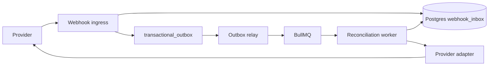
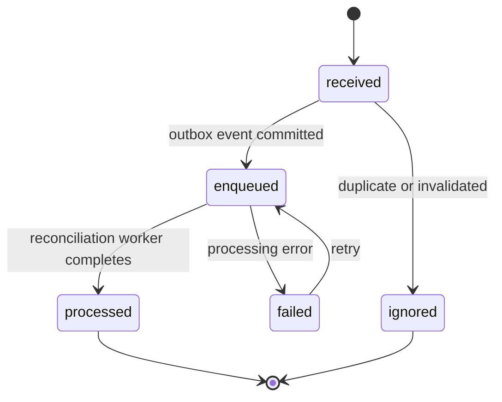
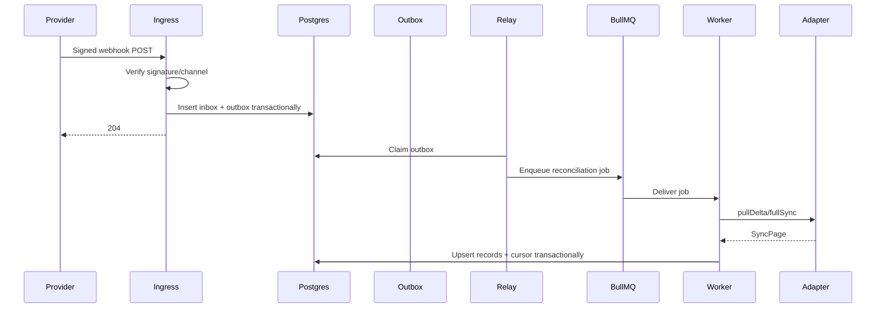

# TDD-06: Webhook Ingestion & Reconciliation

- Status: Deferred to Phase 2 — design complete, implementation not in MVP scope
- Owner: Backend Architect
- Reviewers: Mobile, Product, Security
- Created: 2026-08-23
- Last updated: 2026-08-23
- Target release / feature flag: `creatoros.webhook_ingestion.v1`
- MVP Scope Note: Per `v2/creator_os_product_scope.md` §3.2, webhook ingestion is Phase 2.
  The MVP uses scheduled polling and user-triggered sync only.
  This document is retained as the authoritative design for when webhooks are implemented.
- Related PRD: `v2/creator_os_prd_v2.md`
- Related API: `v2/api/openapi/creatoros-public.openapi.yaml`
- Related architecture: `v2/architecture/ARCHITECTURE-15-backend-connector-service-v2.md`
- Related cross-cutting: `v2/api/cross-cutting/webhooks.md`
- ADRs: `v2/architecture/ARCHITECTURE-10-open-decisions-v2.md`

---

## 1. Decision Summary

### Problem

Google Drive, Google Calendar, and Notion can notify CreatorOS about changes via webhooks. But webhook payloads are incomplete, can be duplicated, delayed, out of order, or forged. They cannot be trusted as the source of truth for content synchronization.

### Proposed Decision

Treat webhooks as **durable hints**, not data. Ingest them into a `webhook_inbox` table, verify authenticity first, persist and deduplicate before acknowledging, then enqueue a reconciliation job. The connector worker later fetches canonical state from the provider using stored cursors or provider-specific APIs.

### Goals

- Guarantee no valid webhook is lost after acknowledgement.
- Guarantee duplicate webhook delivery does not cause duplicate provider work.
- Validate Google/Notion signatures and channel metadata before trust.
- Keep webhook handlers fast and free of synchronous provider API calls.
- Reconcile provider state using official cursor/delta mechanisms.
- Maintain scheduled polling as a fallback even when webhooks are healthy.

### Non-goals

- Treating a webhook body as a complete changed record.
- Calling Google or Notion APIs inside the HTTP webhook handler.
- Using webhook delivery as the authoritative sync cursor.
- Exposing webhook inbox IDs or provider channel details to mobile.
- Real-time push to mobile from the webhook path.

### Acceptance Criteria

- Given a valid webhook, when the handler persists the inbox event and outbox event transactionally, only then does it return `204`.
- Given a duplicate webhook delivery, when the handler receives the same provider delivery ID, the inbox unique constraint prevents duplicate processing.
- Given an invalid signature, when the handler verifies it, it returns `401` and does not enqueue reconciliation.
- Given an unknown Google channel ID, when the handler receives it, it returns `404` or `204` without enqueuing work.
- Given a valid Notion webhook, when the handler processes it, it verifies HMAC over the raw body and enqueues a deduplicated connection sync.
- Given a webhook burst of 50 notifications for one connection, when the worker reconciles, only one current sync job is active for that connection.
- Given database downtime, when a webhook arrives, the handler returns `503` so the provider retries.
- Given Google channel expiry, when the scheduled renewal worker runs, it creates a replacement before the old channel expires.
- Given a provider cursor invalidation, when the worker reconciles, it triggers a full resync for that scope.

---

## 2. Context and Constraints

### Existing Architecture

Webhook ingestion is a public-facing path. It must coexist with the mobile API, the connector worker, and provider adapters. Google Drive and Calendar use expiring watch channels; Notion uses HMAC-signed event delivery.

### Constraints

- HTTPS only with valid publicly trusted certificates.
- Google webhook endpoints require TLS valid certificates.
- Notion signature verification must use raw request body.
- Google channel tokens must be verified in constant time.
- Webhook handlers must finish quickly; no provider calls.
- Provider delivery is at least once in practice, even if provider docs say otherwise.
- BullMQ/Redis may be temporarily unavailable.

### Assumptions

- Provider subscription metadata is persisted in Postgres.
- Notion verification tokens are encrypted at rest.
- Google channel tokens are high-entropy and hashed or encrypted.
- Provider cursors are managed by the worker, not the ingress.

---

## 3. Architecture and Ownership

### Context Diagram



### Component Responsibilities

| Component | Owns | Reads | Writes | Must not own |
|---|---|---|---|---|
| Webhook ingress | signature verification, inbox persistence, dedupe | provider request | webhook_inbox, outbox | provider API calls |
| Outbox relay | publishing events | outbox | BullMQ | sync semantics |
| Reconciliation worker | delta sync, full resync, cursor management | adapter | DB, queue state | signature verification |
| Provider adapter | provider request/response mapping, cursor handling | provider | no direct DB | queue semantics |
| Sync scheduler | periodic fallback polling | DB | job enqueue | webhook verification |

---

## 4. Domain and State Design

### Domain Objects

| Entity | Fields & Invariants | Owner | Persistence |
|---|---|---|---|
| `WebhookInboxEntry` | id, provider, deliveryId, connectionId, subscriptionId, channelId, resourceId, messageNumber, eventType, payloadHash, payloadJson, receivedAt, processedAt, processingStatus; unique `(provider, deliveryId)` | Ingress | Postgres |
| `OutboxEvent` | id, aggregateType, aggregateId, eventType, schemaVersion, payload, availableAt, publishedAt, attempts | Ingress/API | Postgres |
| `SyncRequest` | workspaceId, connectionId, streamName, reason, requestedAt, state | Worker | Postgres |
| `SyncState` | workspaceId, connectionId, streamName, cursor, syncStatus, lastAttemptAt, lastSuccessAt, lastErrorCode | Worker | Postgres |

### Webhook Processing State



### Sync Request State

```text
pending -> scheduled -> running -> completed
pending -> scheduled -> cancelled
running -> failed -> scheduled
```

### Invariants

- A webhook is never acknowledged before inbox + outbox transaction commit.
- A duplicate delivery ID never produces a second inbox row.
- The webhook body never drives direct local state overwrite.
- Cursor advancement happens only in the worker after provider reconciliation.
- Channel renewal always overlaps old and new channels where possible.

---

## 5. End-to-End Data Flow

### Primary Ingestion Flow



### Deduplication Flow

1. Ingress derives provider-specific dedupe key.
2. Ingress attempts `INSERT` into `webhook_inbox`.
3. If unique constraint conflict, treat as duplicate.
4. Do not enqueue duplicate outbox event.
5. Return `204` after transaction.

---

## 6. Persistence and Search Design

### 6.1 Webhook Inbox Schema

Use `webhook_inbox` schema from `v2/api/cross-cutting/webhooks.md`.

### 6.2 Indexes

```sql
CREATE UNIQUE INDEX webhook_inbox_provider_delivery_unique
ON webhook_inbox(provider, delivery_id);

CREATE INDEX webhook_inbox_processing_idx
ON webhook_inbox(processing_status, received_at);
```

### 6.3 Search Impact

Webhook payloads are never indexed in search. Only normalized records persisted by the reconciliation worker enter the search index.

---

## 7. Public and Internal Contracts

### 7.1 Webhook Routes

| Provider | Route | Auth |
|---|---|---|
| Google Drive | `POST /webhooks/google-drive` | Channel ID + token |
| Google Calendar | `POST /webhooks/google-calendar` | Channel ID + token |
| Notion | `POST /webhooks/notion` | HMAC signature |

### 7.2 Event Contracts

Queue events:

- `webhook.reconcile.v1`
- `connection.sync.v1`
- `subscription.renew.v1`

Payloads include only IDs and provider names, never raw webhook data.

---

## 8. Platform Implementation

### 8.1 Ingress Structure

```text
apps/webhook-ingress/src/
├── routes/
│   ├── notionWebhookRoute.ts
│   ├── googleDriveWebhookRoute.ts
│   └── googleCalendarWebhookRoute.ts
├── verification/
│   ├── NotionSignatureVerifier.ts
│   └── GoogleChannelVerifier.ts
├── persistence/
│   ├── WebhookInboxRepository.ts
│   └── WebhookOutboxWriter.ts
└── server.ts
```

### 8.2 Notion Verification

Use raw body HMAC-SHA256 with constant-time comparison. The verification token is encrypted in the subscription registry.

### 8.3 Google Verification

Google does not sign arbitrary bodies. Verify:

- `X-Goog-Channel-ID` matches active channel.
- `X-Goog-Channel-Token` matches stored high-entropy secret.
- `X-Goog-Resource-ID` matches watched resource.
- Channel is not expired.
- `X-Goog-Message-Number` is syntactically valid and not a replay of an old message if possible.

### 8.4 Reconciliation Worker

Worker processors:

- `WebhookReconcileProcessor`
- `ConnectionDeltaSyncProcessor`
- `ConnectionFullSyncProcessor`
- `SubscriptionRenewalProcessor`

Sync job coalescing:

Use `sync_requests` table with debounced `requested_at`. A burst of webhooks results in at most one active sync per connection/stream.

---

## 9. Failure, Security, and Recovery

### 9.1 Failure Matrix

| Failure | Handling |
|---|---|
| Invalid Notion signature | 401, no inbox row |
| Unknown Google channel | 404 or quiet 204, no enqueue |
| Duplicate delivery | unique constraint no-op |
| DB unavailable | 503; rely on provider retry |
| Queue unavailable | Ingress returns 204 after DB commit; relay retries later |
| Worker unavailable | Outbox remains pending |
| Cursor invalidated | Full resync for scope |
| Channel expired | Scheduled renewal fallback |
| Message number gap | Do not infer loss; sync from cursor |
| Poison reconciliation job | Repair case, safe diagnostics |

### 9.2 Security and Privacy

- Google channel tokens and Notion verification tokens are encrypted.
- Raw webhook payload retention is limited and privacy-reviewed.
- Webhook routes are separate from mobile API routes.
- No raw payloads in logs, metrics, or repair cases.
- No provider tokens in queue payloads.

---

## 10. Observability

### Metrics

| Metric | Dimensions |
|---|---|
| `webhook_received_total` | provider, verification_result |
| `webhook_duplicate_total` | provider |
| `webhook_inbox_lag_seconds` | provider |
| `webhook_reconcile_job_total` | provider, status |
| `subscription_renewal_total` | provider, status |
| `sync_cursor_age_seconds` | provider |

### Logs and Spans

Log only:

```text
provider
delivery_id_hash
channel_id_hash
webhook_inbox_id
event_type
processing_status
latency_ms
```

---

## 11. Test Strategy

### 11.1 Testable Invariants

| Invariant | Test Method |
|---|---|
| Invalid signature does not enqueue | Signature test |
| Duplicate delivery does not enqueue | Unique constraint test |
| Valid webhook persists inbox + outbox atomically | Transaction kill test |
| 50 webhook burst creates one sync job | Coalescing test |
| Cursor advances only after worker commit | Fault injection |
| Google channel expiry triggers renewal | Scheduler test |
| DB outage returns 503 | Failure injection |
| Full resync triggered on cursor invalid | Adapter + worker test |

### 11.2 Test Matrix

| Provider | Tests |
|---|---|
| Notion | HMAC, verification handshake, duplicate events |
| Google Drive | Channel validation, changes sync, watch renewal |
| Google Calendar | Channel validation, sync token, 410 resync |
| All | Outbox, queue, retry, poison messages |

---

## 12. Open Questions

| Question | Owner | Default |
|---|---|---|
| Should raw webhook payload be retained? | Security | No, except short-term sanitized audit |
| How long should webhook inbox entries be retained? | Backend | 30 days |
| Should Google channel renewal use a dedicated queue? | Backend | Yes |
| Should Notion webhook reconciliation be per event? | Backend | No, coalesce per connection |

---

## 13. Change Log

| Version | Date | Summary |
|---|---|---|
| 1.0 | 2026-08-23 | Created Webhook Ingestion & Reconciliation TDD. |
