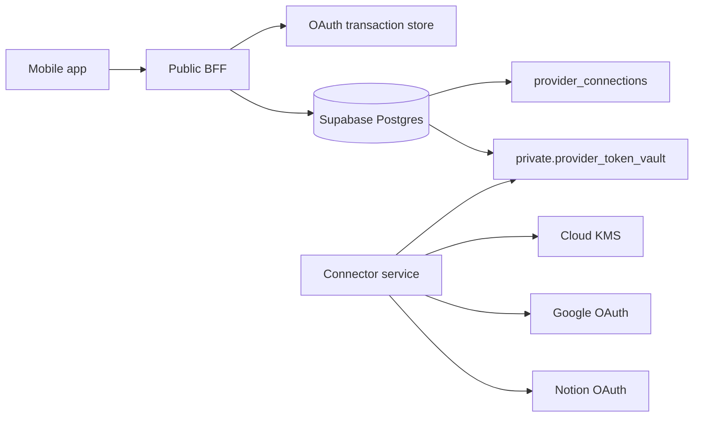
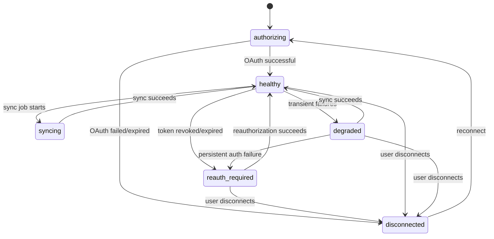
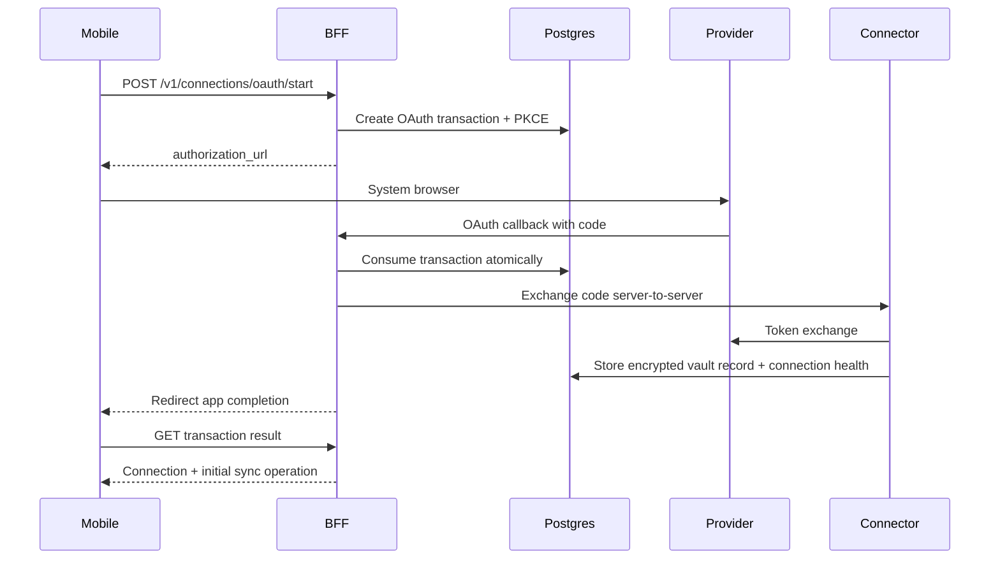
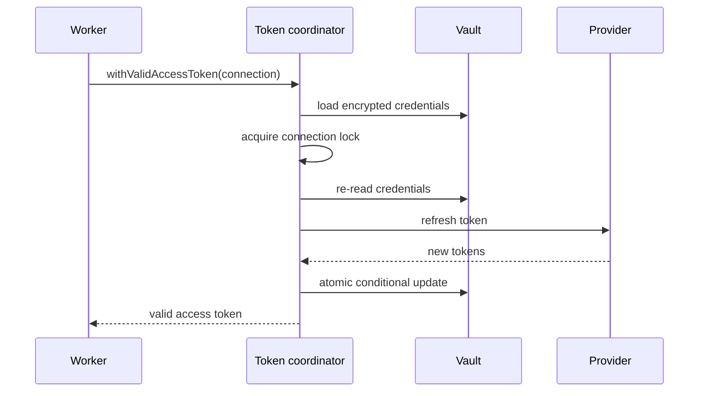

# TDD-07: OAuth, Token Vault & Connection Health

- Status: In review
- Owner: Security Architect
- Reviewers: Backend, Product, Mobile
- Created: 2026-08-23
- Last updated: 2026-08-23
- Target release / feature flag: `creatoros.oauth_token_vault.v1`
- Related PRD: `v2/creator_os_prd_v2.md`
- Related API: `v2/api/auth/oauth-flows.md`, `v2/api/auth/token-vault.md`, `v2/api/auth/reauthorization.md`
- Related architecture: `v2/architecture/ARCHITECTURE-13-connector-architecture-v2.md`
- ADRs: `v2/architecture/ARCHITECTURE-10-open-decisions-v2.md`

---

## 1. Decision Summary

### Problem

CreatorOS connects to Google Drive, Google Docs, Google Calendar, and Notion through OAuth. Provider access tokens and refresh tokens are highly sensitive. They must never reach mobile clients, logs, receipts, or analytics. Token refreshes, account revocation, and reauthorization need to be safe, serialized, and recoverable.

### Proposed Decision

Use a **server-side token vault** with envelope encryption. The connector worker is the only component allowed to decrypt and use provider tokens. The mobile app only sees a safe `Connection` projection with provider, account label, health state, capabilities, and last sync timestamp.

Use OAuth Authorization Code + PKCE with a backend callback for all providers. Store provider tokens in an encrypted private table. Use per-connection locks for refresh and atomic credential rotation.

### Goals

- Keep provider tokens server-side only.
- Prevent concurrent refresh races from corrupting credentials.
- Detect revoked or expired tokens and transition connections to `reauth_required`.
- Provide safe reauthorization without silently replacing accounts.
- Support multiple accounts of the same provider per workspace.
- Provide a clear connection-health model that mobile can render.

### Non-goals

- Storing provider tokens in mobile Keychain/Keystore for backend actions.
- Using CreatorOS password as the encryption key for provider tokens.
- Logging or displaying provider tokens.
- Allowing mobile to request arbitrary OAuth scopes.
- Auto-switching provider accounts without user confirmation.

### Acceptance Criteria

- Given a completed OAuth callback, when the backend exchanges the code, the provider refresh token is encrypted and stored only in the server vault.
- Given a provider API call with an expired access token, the connector worker refreshes once under connection lock and retries.
- Given concurrent refresh attempts, only one refresh proceeds; the loser reuses the winner’s token.
- Given a provider `invalid_grant`, the connection state becomes `reauth_required` and automatic retries stop.
- Given a reauthorization callback with a different provider account, the backend does not silently replace the existing connection.
- Given a user disconnect, the local token vault row is deleted and the provider revocation is attempted best-effort.
- Given Notion refresh, both access and refresh tokens are atomically replaced.

---

## 2. Context and Constraints

### Existing Architecture

The BFF starts OAuth transactions and redirects providers to a backend callback. The connector service owns provider token refresh and API clients. The worker only receives connection IDs, never tokens.

### Constraints

- Google refresh tokens are typically returned only during the first authorization flow.
- Notion refresh returns a new access token and a new refresh token.
- Google Testing-mode refresh tokens may expire in 7 days.
- Restricted Google scopes may require OAuth verification and CASA.
- Token vault data must not be accessible through normal RLS to mobile clients.

### Assumptions

- KMS or equivalent key management is available.
- The connector service runs with a dedicated database role.
- Provider OAuth apps are registered with HTTPS backend callbacks.
- Connection metadata is stored separately from encrypted tokens.

---

## 3. Architecture and Ownership

### Context Diagram



### Component Responsibilities

| Component | Owns | Reads | Writes | Must not own |
|---|---|---|---|---|
| BFF | OAuth transaction lifecycle, public connection projection | Postgres | OAuth state, connection metadata | provider tokens |
| Connector service | token refresh, client factory, provider calls | encrypted vault | encrypted credentials | user API |
| Token vault | encrypted token records | connection ID | encrypted tokens | business state |
| Connection health service | health state transitions | connection health rows | health projections | provider execution |

---

## 4. Domain and State Design

### Domain Objects

| Entity | Fields & Invariants | Owner | Persistence |
|---|---|---|---|
| `Connection` | id, workspaceId, provider, providerAccountId, accountLabel, scopes, capabilities, healthState, lastSyncAt, createdAt, updatedAt; unique `(workspace_id, provider, provider_account_id)` | BFF/API | Postgres |
| `OAuthTransaction` | id, provider, connectionId, mode, state, codeVerifierHash, redirectBinding, expiresAt, consumedAt | BFF | Postgres |
| `TokenVaultRecord` | connectionId, keyVersion, encryptedAccessToken, encryptedRefreshToken, tokenType, expiresAt, scopeSnapshot, refreshedAt, refreshFailures, updatedAt | Connector | private Postgres |

### Connection Health States



### OAuth Transaction States

```text
pending -> succeeded
pending -> failed
pending -> expired
```

---

## 5. End-to-End Data Flow

### OAuth Connection Flow



### Token Refresh Flow



---

## 6. Persistence and Search Design

### 6.1 Token Vault Schema

Use private schema from `v2/api/auth/token-vault.md`.

### 6.2 Connection Metadata Schema

Public-safe columns in `provider_connections`. Token ciphertext stays in a private table.

### 6.3 OAuth Transaction Schema

```sql
CREATE TABLE oauth_transactions (
  id UUID PRIMARY KEY,
  workspace_id UUID NOT NULL,
  provider TEXT NOT NULL,
  connection_id UUID,
  mode TEXT NOT NULL,
  state TEXT NOT NULL,
  code_verifier_hash TEXT NOT NULL,
  redirect_binding TEXT NOT NULL,
  created_at TIMESTAMPTZ NOT NULL,
  expires_at TIMESTAMPTZ NOT NULL,
  consumed_at TIMESTAMPTZ
);
```

---

## 7. Public and Internal Contracts

### 7.1 Public API

Public API endpoints:

- `POST /v1/connections/oauth/start`
- `GET /v1/oauth/callback/{provider}`
- `GET /v1/connections/oauth/transactions/{transactionId}`
- `POST /v1/connections/{connectionId}:reauthorize`
- `DELETE /v1/connections/{connectionId}`
- `GET /v1/connections`
- `GET /v1/connections/{connectionId}`

Mobile never receives provider token fields.

### 7.2 Internal Contracts

Connector service methods:

- `exchangeAuthorizationCode(provider, code, codeVerifier)`
- `refreshAccessToken(connectionId)`
- `revokeProviderToken(connectionId)`
- `reauthorizeConnection(connectionId, requestedCapabilities)`

---

## 8. Platform Implementation

### 8.1 Connector Service Structure

```text
apps/connector-service/src/
├── credentials/
│   ├── ConnectionCredentialRepository.ts
│   ├── TokenRefreshCoordinator.ts
│   ├── CredentialCrypto.ts
│   └── ConnectionLock.ts
├── oauth/
│   ├── OAuthTransactionManager.ts
│   └── OAuthCallbackHandler.ts
└── connection-health/
    └── ConnectionHealthService.ts
```

### 8.2 Credential Rotation

Use a conditional update keyed by `version`.

```sql
UPDATE private.provider_token_vault
SET encrypted_access_token = $1,
    encrypted_refresh_token = $2,
    access_token_expires_at = $3,
    version = version + 1,
    updated_at = now()
WHERE connection_id = $4
  AND version = $5;
```

If no rows update, reload and use the winner’s tokens.

### 8.3 Refresh Failure Policy

| Failure | State | Retry |
|---|---|---|
| Network transient | degraded | yes |
| Provider 5xx | degraded | yes bounded |
| 401 invalid_grant | reauth_required | no until reconnect |
| Refresh token revoked | reauth_required | no |
| Missing scope | reauth_required | no |

---

## 9. Failure, Security, and Recovery

### 9.1 Failure Matrix

| Failure | Handling |
|---|---|
| OAuth callback replay | consume transaction once; reject reused state |
| User closes browser | expired transaction |
| Provider account mismatch | explicit user choice, no silent replace |
| Duplicate OAuth account | `PROVIDER_ACCOUNT_ALREADY_CONNECTED` |
| Notion refresh rotation write fails | high severity; do not continue using unpersisted token |
| Redis lock expiration during refresh | require DB-level version check |
| KMS key rotation | re-encrypt token keys asynchronously |
| User disconnects while job runs | verify connection version before provider call and success persistence |

### 9.2 Security and Privacy

- Provider tokens never in logs, metrics, receipts, queue payloads, or analytics.
- Vault table not accessible via Supabase RLS.
- BFF never decrypts provider tokens.
- OAuth client secrets stored only in backend secret manager.
- Mobile never receives refresh tokens.

---

## 10. Observability

### Metrics

| Metric | Dimensions |
|---|---|
| `oauth_transaction_total` | provider, outcome |
| `provider_token_refresh_total` | provider, result |
| `provider_token_refresh_duration_ms` | provider |
| `connection_reauth_required_total` | provider |
| `provider_token_revocation_total` | provider, result |

### Logs

Log only:

```text
connection_id
provider
token_scope_snapshot_hash
refresh_result_code
latency_ms
```

---

## 11. Test Strategy

### 11.1 Testable Invariants

| Invariant | Test Method |
|---|---|
| Provider token never returned to mobile | API contract test |
| Concurrent refresh is serialized | Concurrency test |
| Notion token rotation atomic | Fault injection |
| Google refresh token preserved if new response omits it | OAuth exchange test |
| Reauth wrong account does not replace | Account mismatch test |
| Disconnect deletes vault row | DB state test |
| Reused OAuth state is rejected | Replay test |

### 11.2 Test Matrix

| Provider | Tests |
|---|---|
| Google | code exchange, refresh, 401, invalid_grant, testing-mode expiry |
| Notion | code exchange, refresh, refresh rotation, webhook verification token |
| All | connection lock, vault encryption, revocation |

---

## 12. Open Questions

| Question | Owner | Default |
|---|---|---|
| Should provider tokens be rotated proactively? | Backend | Only on expiry/401 |
| Should Google OAuth use loopback? | Backend | No; use HTTPS backend callback |
| Should account switch be allowed in reauth? | Product | Yes, as explicit user choice |
| Should connection health expose last error? | Product | Safe error code only |

---

## 13. Change Log

| Version | Date | Summary |
|---|---|---|
| 1.0 | 2026-08-23 | Created OAuth, Token Vault & Connection Health TDD. |
