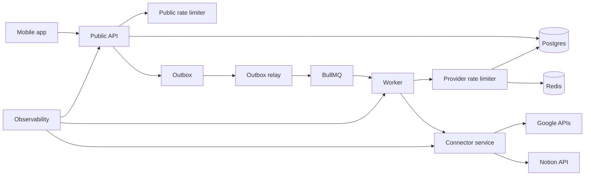
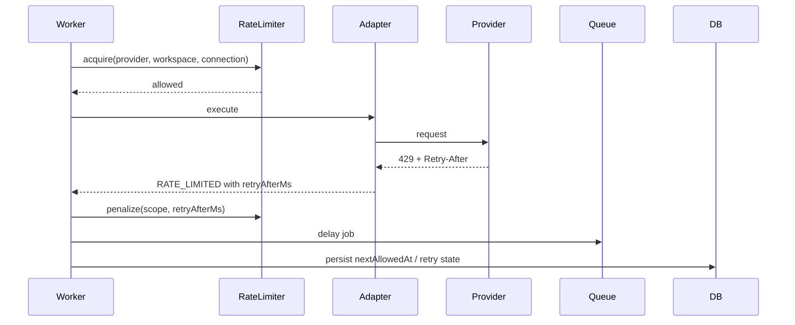

# TDD-08: Rate Limiting, Scheduling & Observability

- Status: In review
- Owner: Platform Engineer
- Reviewers: Backend, Product, Security
- Created: 2026-08-23
- Last updated: 2026-08-23
- Target release / feature flag: `creatoros.rate_limit_observability.v1`
- Related PRD: `v2/creator_os_prd_v2.md`
- Related API: `v2/api/cross-cutting/rate-limits.md`
- Related architecture: `v2/architecture/ARCHITECTURE-15-backend-connector-service-v2.md`
- ADRs: `v2/architecture/ARCHITECTURE-10-open-decisions-v2.md`

---

## 1. Decision Summary

### Problem

CreatorOS depends on Google Drive, Docs, Calendar, and Notion APIs, each with different rate limits and quota models. A single aggressive tenant or a provider-wide throttling event can block other users and consume critical quota. The system must enforce fair, provider-aware scheduling while maintaining observability.

### Proposed Decision

Use **layered rate limiting**:

- Public mobile API: user/workspace/route-based limits.
- Provider adapters: project, workspace, connection, and action-class limits.
- Redis token buckets for fast admission control.
- Postgres for authoritative persisted throttle state and next-eligible timestamps.
- Provider `Retry-After` and `429/403/5xx` signals treated as authoritative.

Use provider-isolated BullMQ queues with job coalescing. Interactive actions receive priority; full resyncs are throttled.

Use structured observability across API, worker, connector, and provider calls with correlation IDs, metrics, logs, and runbooks.

### Goals

- Prevent one tenant from starving others.
- Prevent accidental provider quota exhaustion.
- Keep interactive actions responsive.
- Recover safely from Redis or Postgres throttle-state loss.
- Provide dashboards and alerts for queue lag, freshness, throttle pressure, and OAuth failures.
- Make every request traceable across services.

### Non-goals

- Replacing BullMQ with a custom scheduler.
- Implementing a general-purpose workflow engine.
- Exposing provider quota internals to mobile.
- Sending raw provider errors or tokens to observability.
- Creating per-tenant queues prematurely.
- Claiming exactly-once provider execution.

### Acceptance Criteria

- Given a provider 429 with `Retry-After`, the worker schedules the job after that delay and does not consume a normal retry attempt.
- Given a burst of 50 webhook notifications for one connection, only one sync job is active for that connection.
- Given a full resync running for Drive, other sync streams remain responsive.
- Given Redis unavailable, provider throttling state remains recoverable from Postgres next-eligible timestamps.
- Given a provider outage, the worker delays jobs with bounded backoff and does not hot-loop retry.
- Given a public API rate limit, the response includes `RateLimit-Policy` and `RateLimit` headers and a `RATE_LIMITED` problem.
- Given a provider-wide failure spike, an alert fires within 15 minutes.
- Given every cross-service request, the trace includes operation, receipt, job, connection, and provider correlation IDs.

---

## 2. Context and Constraints

### Existing Architecture

The public BFF, outbox relay, connector worker, and provider adapters already share Postgres and BullMQ. Provider tokens live only in the connector service. Webhooks are durable hints.

### Constraints

- Google APIs have per-project and per-user quota dimensions.
- Notion has per-connection and shared workspace rate limits.
- Drive `files.list` is more quota-expensive than `files.get`.
- Watch channel create/stop consumes quota; notifications do not.
- Redis may lose data; Postgres persists throttle/next-eligible state.
- Interactive mobile actions must not be blocked by background sync storms.

### Assumptions

- Redis is managed and highly available.
- Queue workers can be scaled horizontally.
- Provider adapters return normalized `ProviderError`.
- Rate policies can be updated via remote config.

---

## 3. Architecture and Ownership

### Context Diagram



### Component Responsibilities

| Component | Owns | Reads | Writes | Must not own |
|---|---|---|---|---|
| Public API rate limiter | user/workspace route limits | policy config | throttle state | provider quotas |
| Provider rate limiter | provider/workspace/connection budgets | Redis + Postgres | throttle state | user identity |
| Queue scheduler | job admission, coalescing, priority | BullMQ | queue jobs | provider business |
| Worker | execution, retry classification | DB/queue/adapters | receipts/operations | provider tokens |
| Connector | token refresh, adapter call | encrypted tokens | adapter results | durable business |
| Observability | metrics/logs/traces | all service spans | dashboards | raw user content |

---

## 4. Domain and State Design

### Domain Objects

| Entity | Fields & Invariants | Owner | Persistence |
|---|---|---|---|
| `RateLimitPolicy` | provider, scope, key, capacity, refillPerSecond, burst, retryAfterMs | Platform | remote config |
| `ThrottleState` | scope, provider, nextAllowedAtMs, lastRetryAfterMs | Worker | Postgres |
| `JobState` | jobId, type, provider, connectionId, priority, attempts, nextAttemptAt | Worker | Postgres |
| `CorrelationContext` | requestId, operationId, receiptId, outboxEventId, jobId, connectionId, providerRequestId | Platform | in-memory/propagated |

### Rate Limit Scopes

```text
google:project
google:connection:{connectionId}
google:workspace:{providerWorkspaceId}

notion:integration
notion:connection:{connectionId}

creatoros:workspace:{workspaceId}:plan
creatoros:route:{routeTemplate}:{userId}
```

### Backoff State

```text
normal -> backoff_1 -> backoff_2 -> backoff_3 -> delayed -> repair
```

---

## 5. End-to-End Data Flow

### Rate-Limited Provider Call



### Queue Coalescing

A sync request table with debounced `requested_at` ensures one active sync per connection stream. A burst of webhooks updates the watermark but does not enqueue multiple sync jobs.

---

## 6. Persistence and Search Design

### 6.1 Throttle Table

```sql
CREATE TABLE provider_throttle_state (
  id UUID PRIMARY KEY,
  provider TEXT NOT NULL,
  scope_key TEXT NOT NULL,
  next_allowed_at_ms INTEGER NOT NULL,
  last_retry_after_ms INTEGER,
  created_at TIMESTAMPTZ NOT NULL DEFAULT now(),
  updated_at TIMESTAMPTZ NOT NULL DEFAULT now(),
  UNIQUE(provider, scope_key)
);
```

### 6.2 Metrics Schema

Metrics are emitted to Prometheus; no user content is stored.

---

## 7. Public and Internal Contracts

### 7.1 Public Rate Limit Headers

Use:

```http
RateLimit-Policy: "search";q=60;w=60
RateLimit: "search";r=47;t=38
Retry-After: 38
```

### 7.2 Internal Policy Config

Remote config specifies provider default policies:

```json
{
  "google_drive": {
    "files_list_per_minute": 100,
    "connection_capacity": 20,
    "workspace_capacity": 50
  },
  "notion": {
    "connection_capacity_per_second": 2,
    "workspace_capacity_per_second": 3
  }
}
```

---

## 8. Platform Implementation

### 8.1 Rate Limiter Structure

```text
apps/worker/src/scheduling/
├── ProviderRateLimiter.ts
├── TokenBucket.ts
├── BackoffPolicy.ts
└── ConnectionLock.ts
```

### 8.2 Token Bucket

Use Lua script or equivalent atomic Redis token bucket with fallback to Postgres `next_allowed_at`.

### 8.3 BullMQ Worker Configuration

Separate queues:

- `provider-sync`
- `provider-action-google-drive`
- `provider-action-google-docs`
- `provider-action-google-calendar`
- `provider-action-notion`
- `provider-webhook-reconcile`
- `provider-repair`

---

## 9. Failure, Security, and Recovery

### 9.1 Failure Matrix

| Failure | Handling |
|---|---|
| Redis outage | Use Postgres persisted throttle/next-eligible timestamps |
| Postgres outage | Queue remains; no cursor advancement; retry later |
| Provider 429 with Retry-After | Delay job exactly; do not consume retry attempt |
| Provider 429 without Retry-After | Exponential backoff with full jitter, capped |
| Provider 5xx storm | Circuit break; degraded connection |
| Multiple jobs per connection | Coalesce via sync_requests watermark |
| BullMQ job lost | Outbox relay republishes based on Postgres state |
| Provider quota exhaustion | Mark connection degraded; schedule later |
| Token revoked during rate limit delay | Re-evaluate connection health before next attempt |
| Repair queue accumulating | Alert and runbook; do not auto-drain blindly |

### 9.2 Security and Privacy

- No raw provider error bodies in logs/metrics.
- No tokens in rate limit scope keys or telemetry.
- Telemetry includes only hashed IDs and safe codes.

---

## 10. Observability

### Metrics

| Metric | Dimensions | Alert |
|---|---|---|
| `public_api_rate_limit_hit_total` | route, workspace | spike |
| `provider_rate_limited_total` | provider, scope | throttle pressure |
| `bullmq_waiting_jobs` | queue | backlog |
| `bullmq_failed_jobs_total` | queue, error_code | failure spike |
| `outbox_oldest_unpublished_seconds` | event_type | paging threshold |
| `sync_cursor_age_seconds` | provider | freshness |
| `connection_reauth_required_total` | provider | revocation wave |
| `operation_time_to_receipt_seconds` | provider, operation type | p95 |

### Correlation IDs

Every service propagates:

```text
request_id
trace_id
correlation_id
causation_id
workspace_id
connection_id
operation_id
receipt_id
outbox_event_id
bullmq_job_id
webhook_inbox_id
provider_request_id
credential_version
```

### Alerts

- Provider failure rate >10% for 15 minutes.
- Outbox oldest unpublished >5 minutes.
- Queue depth >1000.
- Search latency p95 >2s.
- Webhook inbox lag >10 minutes.
- Unknown provider outcome >0 for high-severity actions.

---

## 11. Test Strategy

### 11.1 Testable Invariants

| Invariant | Test Method |
|---|---|
| 429 with Retry-After doesn't burn retry attempt | Worker test |
| 50 webhooks produce one sync job | Coalescing test |
| Redis outage doesn't lose throttle state | Postgres fallback test |
| One tenant cannot starve another | Multi-tenant rate test |
| Full resync doesn't block interactive actions | Priority/queue test |
| Cursor advances only after commit | Fault injection |
| Provider failure spike alerts fire | Observability integration |

### 11.2 Test Matrix

| Layer | Tests |
|---|---|
| Public API | rate limit headers, 429 response |
| Provider limiter | token bucket, retry-after, Postgres fallback |
| Worker | backoff, coalescing, provider isolation |
| Queue | burst handling, DLQ |
| Observability | correlation tracing, metrics, alerts |

---

## 12. Open Questions

| Question | Owner | Default |
|---|---|---|
| Should full resync concurrency be 2? | Backend | Yes |
| Should provider capacity be per workspace or per account? | Backend | Per account/connection |
| Should public API limits be per user or workspace? | Product | Per workspace route |
| Should we use dedicated queues per provider now? | Backend | Yes for MVP stability |

---

## 13. Change Log

| Version | Date | Summary |
|---|---|---|
| 1.0 | 2026-08-23 | Created Rate Limiting, Scheduling & Observability TDD. |
