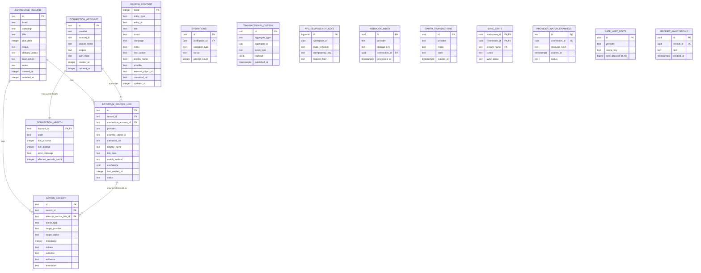

# Database Design / ERD — CreatorOS v2 MVP

**Version:** 1.0  
**Date:** 2026-08-23  
**Status:** Ready for Development  
**Related:** v2/architecture/ARCHITECTURE-03-data-layer-v2.md  
**Related:** docs/architecture/data-dictionary.md  

---

## 1. Purpose

This document defines the complete database design for CreatorOS v2 MVP.

It includes:

- Entity-Relationship Diagram (Mermaid)
- Local SQLite/SQLCipher table definitions
- Backend Postgres table definitions
- Indexes, constraints, relationships
- FTS5 search schema
- Migration notes

This document is authoritative for database implementation. Where v1 tables are retained for legacy modules, they are referenced but not central.

---

## 2. Core Design Decision

- Local SQLite is the source of truth for connected content records, receipts, and source links.
- Backend Postgres holds normalized external metadata for cross-tool search and operation logs.
- `connected_record` replaces v1 `content_item` as the active core object.
- `external_source_link` connects a record to an external object through a specific `connection_account`.
- `action_receipt` is append-only and immutable.
- `search_content` is an FTS5 external-content table that indexes both records and external source links.

---

## 3. Entity-Relationship Diagram



---

## 4. Local SQLite Tables

### 4.1 `connected_record`

| Column | Type | Constraints | Description |
|---|---|---|---|
| id | TEXT | PRIMARY KEY | UUID |
| brand | TEXT | NULL | Brand or client |
| campaign | TEXT | NULL | Campaign name |
| title | TEXT | NOT NULL | Record title |
| due_date | INTEGER | NULL | Unix epoch ms |
| status | TEXT | NOT NULL DEFAULT 'draft' | Workflow stage |
| delivery_status | TEXT | NULL | Delivered / in review |
| next_action | TEXT | NULL | Computed next action text |
| notes | TEXT | NULL | User notes |
| created_at | INTEGER | NOT NULL | Unix epoch ms |
| updated_at | INTEGER | NOT NULL | Unix epoch ms |

**Indexes:**

- `idx_connected_record_updated_at` on `updated_at DESC`
- `idx_connected_record_status` on `status`
- `idx_connected_record_due_date` on `due_date`

---

### 4.2 `external_source_link`

| Column | Type | Constraints | Description |
|---|---|---|---|
| id | TEXT | PRIMARY KEY | UUID |
| record_id | TEXT | NOT NULL, FK to connected_record.id | Owning record |
| connection_account_id | TEXT | NOT NULL, FK to connection_account.id | Account used |
| provider | TEXT | NOT NULL | drive, docs, calendar, notion |
| external_object_id | TEXT | NULL | Provider object ID |
| canonical_url | TEXT | NULL | Permanent URL |
| display_name | TEXT | NULL | Human-readable source title |
| link_type | TEXT | NULL | brief, script, footage, design, edit, delivery, other |
| match_method | TEXT | NULL | explicit_url, object_id, metadata_match, user_confirmed |
| confidence | REAL | NULL | 0–1 when metadata matched |
| last_verified_at | INTEGER | NULL | Last provider check |
| status | TEXT | NOT NULL DEFAULT 'healthy' | healthy, stale, missing, needs_reauthorization |

**Constraints:**

- UNIQUE (`record_id`, `provider`, `external_object_id`)

**Indexes:**

- `idx_external_source_record` on `record_id`
- `idx_external_source_account` on `connection_account_id`
- `idx_external_source_provider` on `provider`

---

### 4.3 `connection_account`

| Column | Type | Constraints | Description |
|---|---|---|---|
| id | TEXT | PRIMARY KEY | UUID |
| provider | TEXT | NOT NULL | drive, docs, calendar, notion |
| account_id | TEXT | NOT NULL | Provider account ID |
| display_name | TEXT | NULL | User-defined label |
| scopes | TEXT | NULL | Granted scopes (comma separated) |
| auth_state | TEXT | NOT NULL DEFAULT 'disconnected' | connected, stale, needs_reauthorization, error |
| created_at | INTEGER | NOT NULL | Unix epoch ms |
| updated_at | INTEGER | NOT NULL | Unix epoch ms |

**Constraints:**

- UNIQUE (`provider`, `account_id`)

**Indexes:**

- `idx_connection_account_provider` on `provider`

---

### 4.4 `connection_health`

| Column | Type | Constraints | Description |
|---|---|---|---|
| account_id | TEXT | PRIMARY KEY, FK to connection_account.id | One health row per connection |
| state | TEXT | NOT NULL | healthy, stale, needs_reauthorization, error |
| last_success | INTEGER | NULL | Last successful sync |
| last_attempt | INTEGER | NULL | Last attempted sync |
| error_message | TEXT | NULL | User-safe message |
| affected_records_count | INTEGER | NOT NULL DEFAULT 0 | Number of records relying on this connection |

---

### 4.5 `action_receipt`

| Column | Type | Constraints | Description |
|---|---|---|---|
| id | TEXT | PRIMARY KEY | UUID |
| record_id | TEXT | NOT NULL, FK to connected_record.id | Owning record |
| external_source_link_id | TEXT | NULL, FK to external_source_link.id | Optional source |
| action_type | TEXT | NOT NULL | opened, shared, copied, linked, marked_delivered, failed |
| target_provider | TEXT | NULL | drive, docs, notion, canva, capcut, notes |
| target_object | TEXT | NULL | Target object identifier |
| timestamp | INTEGER | NOT NULL | Unix epoch ms |
| initiator | TEXT | NULL | user, backend, system |
| outcome | TEXT | NULL | opened, shared, copied, marked_delivered, failed |
| evidence | TEXT | NULL | URL, file reference, excerpt |
| annotation | TEXT | NULL | User-added note, post-creation |

**Rules:**

- Append-only. No UPDATE/DELETE allowed after insert.
- Annotation may be added via separate action, not modifying original row.

**Indexes:**

- `idx_action_receipt_record_time` on `(record_id, timestamp DESC)`
- `idx_action_receipt_source` on `external_source_link_id`

---

### 4.6 `search_content`

FTS5 external-content table. Not a normal table, but the canonical row source for search.

| Column | Type | Description |
|---|---|---|
| rowid | INTEGER | Primary key |
| entity_type | TEXT | `connected_record` or `external_source_link` |
| entity_id | TEXT | UUID of canonical row |
| title | TEXT | Indexed |
| brand | TEXT | Indexed |
| campaign | TEXT | Indexed |
| notes | TEXT | Indexed |
| next_action | TEXT | Indexed |
| display_name | TEXT | Indexed |
| provider | TEXT | Indexed |
| external_object_id | TEXT | Indexed |
| canonical_url | TEXT | Indexed |
| updated_at | INTEGER | For ranking |

**FTS5 virtual table:**

```sql
CREATE VIRTUAL TABLE search_fts USING fts5(
  title,
  brand,
  campaign,
  notes,
  next_action,
  display_name,
  provider,
  external_object_id,
  canonical_url,
  content='search_content',
  content_rowid='rowid',
  tokenize='unicode61 remove_diacritics 2'
);
```

**Triggers on `connected_record` and `external_source_link` update `search_content` in the same transaction.**

---

## 5. Backend Postgres Tables

### 5.1 `normalized_index`

| Column | Type | Description |
|---|---|---|
| id | UUID | Primary key |
| tenant_id | UUID | CreatorOS account/workspace |
| provider | TEXT | drive, docs, calendar, notion |
| external_id | TEXT | Provider object ID |
| title | TEXT | Indexed full-text + trigram |
| type | TEXT | file, folder, document, event, page |
| url | TEXT | Canonical URL |
| updated_at | TIMESTAMPTZ | Provider timestamp |
| account_id | TEXT | Connection account |
| content_hash | TEXT | Hash for change detection |
| deleted_at | TIMESTAMPTZ | Soft delete |

**Search:**

- `tsvector` generated on `title`
- GIN index on `tsvector`
- GIN `pg_trgm` index on `title`
- B-tree index on `(tenant_id, provider, type, updated_at DESC)`

### 5.2 `operation_log`

| Column | Type | Description |
|---|---|---|
| id | UUID | Primary key |
| operation_id | TEXT | Idempotency key |
| provider | TEXT | Provider |
| account_id | TEXT | Connection account |
| action_type | TEXT | action |
| outcome | TEXT | succeeded, failed, etc |
| error_category | TEXT | normalized error |
| created_at | TIMESTAMPTZ | Event time |

**Rules:**

- Append-only
- No user content stored
- Restricted write role

### 5.3 `connection_token_vault`

| Column | Type | Description |
|---|---|---|
| connection_id | UUID | Primary key |
| encrypted_token | BYTEA | Encrypted provider token |
| wrapped_data_key | BYTEA | KMS-wrapped DEK |
| key_version | TEXT | KMS key version |
| nonce | TEXT | Encryption nonce |
| created_at | TIMESTAMPTZ | Created |
| updated_at | TIMESTAMPTZ | Updated |

Only the connector worker identity may decrypt.

### 5.4 `operations`

| Column | Type | Description |
|---|---|---|
| id | UUID | Primary key |
| workspace_id | UUID NOT NULL, FK to workspace | Owning workspace |
| actor_user_id | UUID NOT NULL | Requesting user |
| connection_id | UUID NULLABLE, FK to connection_account | Related connection when provider-bound |
| operation_type | TEXT NOT NULL | connection_sync, content_handoff, connected_content_delete, source_link_remove, connection_disconnect, search_refresh |
| status | TEXT NOT NULL DEFAULT 'queued' CHECK (status IN ('queued','running','succeeded','failed','cancelled')) | Current state |
| attempt_count | INTEGER NOT NULL DEFAULT 0 | Retry attempts so far |
| max_attempts | INTEGER NOT NULL DEFAULT 10 | Configurable ceiling per type |
| next_retry_at | TIMESTAMPTZ NULLABLE | When to retry after transient failure |
| error_code | TEXT NULLABLE | Normalized CreatorOS error code |
| error_detail | TEXT NULLABLE | User-safe message; never raw provider body |
| created_at | TIMESTAMPTZ NOT NULL DEFAULT now() | Creation time |
| updated_at | TIMESTAMPTZ NOT NULL DEFAULT now() | Last state change |
| completed_at | TIMESTAMPTZ NULLABLE | Terminal transition time |

**Indexes:**

- `idx_operations_status_next_retry` on `(status, next_retry_at)` for worker claim
- `idx_operations_workspace_created` on `(workspace_id, created_at DESC)`

### 5.5 `action_receipts`

| Column | Type | Description |
|---|---|---|
| id | UUID | Primary key |
| workspace_id | UUID NOT NULL, FK to workspace | Owning workspace |
| connected_record_id | UUID NOT NULL, FK to connected_record | Owning record |
| operation_id | UUID NOT NULL, FK to operations | Originating operation |
| action_type | TEXT NOT NULL | opened, shared, copied, linked, marked_delivered, failed, needs_attention |
| target_provider | TEXT NULLABLE | Provider name when applicable |
| target_object | TEXT NULLABLE | Safe external identifier or URL |
| initiator | TEXT NOT NULL DEFAULT 'user' CHECK (initiator IN ('user','system','backend')) | Who triggered |
| outcome | TEXT NOT NULL DEFAULT 'pending' CHECK (outcome IN ('verified','user_confirmed','pending','failed')) | Trust classification |
| evidence | TEXT NULLABLE | Human-readable proof summary; no raw payload |
| occurred_at | TIMESTAMPTZ NOT NULL DEFAULT now() | When the action happened |

**Rules:** Append-only. No UPDATE or DELETE after INSERT. Annotations are separate rows in `receipt_annotations`.

**Indexes:**

- `idx_action_receipts_record_time` on `(connected_record_id, occurred_at DESC)`
- `idx_action_receipts_operation` UNIQUE on `(operation_id)`

### 5.6 `receipt_annotations`

| Column | Type | Description |
|---|---|---|
| id | UUID | Primary key |
| receipt_id | UUID NOT NULL, FK to action_receipts | Annotated receipt |
| author_user_id | UUID NOT NULL | Who wrote the annotation |
| text | TEXT NOT NULL CHECK (LENGTH(text) <= 2000) | Annotation content |
| created_at | TIMESTAMPTZ NOT NULL DEFAULT now() | When written |

**Rules:** Append-only. Original receipt is never modified. Multiple annotations per receipt allowed.

### 5.7 `transactional_outbox`

| Column | Type | Description |
|---|---|---|
| id | UUID | Primary key |
| aggregate_type | TEXT NOT NULL | Entity type that produced this event |
| aggregate_id | UUID NOT NULL | ID of producing entity |
| event_type | TEXT NOT NULL | Semantic event name |
| payload | JSONB NOT NULL | Minimal data needed by consumer; no user content or tokens |
| published_at | TIMESTAMPTZ NULLABLE | Set when relay publishes to queue |
| created_at | TIMESTAMPTZ NOT NULL DEFAULT now() | Event creation time |

**Rules:** Inserted in same transaction as domain mutation. Relay claims unpublished rows using `FOR UPDATE SKIP LOCKED`, publishes to BullMQ, then sets `published_at`. Never deleted; retained for audit.

**Index:**

- Partial index on `(created_at) WHERE published_at IS NULL` for relay polling

### 5.8 `api_idempotency_keys`

| Column | Type | Description |
|---|---|---|
| id | BIGSERIAL | Primary key |
| workspace_id | UUID NOT NULL | Owning workspace |
| actor_user_id | UUID NOT NULL | Requesting user |
| method | TEXT NOT NULL | HTTP method |
| route_template | TEXT NOT NULL | Path template without IDs |
| idempotency_key | TEXT NOT NULL | Client-provided key |
| request_hash | TEXT NOT NULL | SHA-256 of canonical request body |
| response_status | INTEGER NULLABLE | Stored original response status |
| response_body | JSONB NULLABLE | Stored original response for replay |
| operation_id | TEXT NULLABLE | Related operation when applicable |
| receipt_id | TEXT NULLABLE | Related receipt when applicable |
| state | TEXT NOT NULL DEFAULT 'in_progress' | in_progress, completed, expired |
| expires_at | TIMESTAMPTZ NOT NULL | Retention deadline (24–72h) |
| created_at | TIMESTAMPTZ NOT NULL DEFAULT now() | Creation time |

**Constraint:** UNIQUE `(workspace_id, actor_user_id, method, route_template, idempotency_key)`

### 5.9 `webhook_inbox`

| Column | Type | Description |
|---|---|---|
| id | UUID | Primary key |
| provider | TEXT NOT NULL | google_drive, google_calendar, notion |
| dedupe_key | TEXT NOT NULL | Provider-specific unique delivery key |
| connection_id | UUID NULLABLE, FK to connection_account | Resolved connection |
| payload_summary | JSONB NULLABLE | Safe metadata only; never full raw body |
| processed_at | TIMESTAMPTZ NULLABLE | When reconciliation enqueued |
| created_at | TIMESTAMPTZ NOT NULL DEFAULT now() | Delivery received time |

**Rules:** Unique constraint on `(provider, dedupe_key)`. Handler writes inbox row and outbox event in one transaction before returning 204. Never calls provider APIs synchronously.

### 5.10 `sync_state`

| Column | Type | Description |
|---|---|---|
| workspace_id | UUID NOT NULL, FK to workspace | Owning workspace |
| connection_id | UUID NOT NULL, FK to connection_account | Connection being synced |
| stream_name | TEXT NOT NULL | Logical stream (e.g., drive_files, calendar_events, notion_pages) |
| cursor | TEXT NULLABLE | Opaque provider cursor token |
| sync_status | TEXT NOT NULL DEFAULT 'idle' CHECK (sync_status IN ('idle','syncing','failed','requires_full_resync')) | Current state |
| last_attempt_at | TIMESTAMPTZ NULLABLE | Last sync attempt |
| last_success_at | TIMESTAMPTZ NULLABLE | Last successful sync |
| last_error_code | TEXT NULLABLE | Normalized error when failed |
| updated_at | TIMESTAMPTZ NOT NULL DEFAULT now() | Last change |

**Primary Key:** `(workspace_id, connection_id, stream_name)`

### 5.11 `provider_watch_channels`

| Column | Type | Description |
|---|---|---|
| id | TEXT PRIMARY KEY | Google channel ID or Notion subscription ID |
| connection_id | UUID NOT NULL, FK to connection_account | Associated connection |
| provider | TEXT NOT NULL | google_drive, google_calendar, notion |
| resource_kind | TEXT NOT NULL | files, changes, events |
| resource_id | TEXT NOT NULL | Provider resource being watched |
| channel_secret_hash | TEXT NOT NULL | SHA-256 of channel verification secret |
| expires_at | TIMESTAMPTZ NOT NULL | Channel expiry from provider |
| status | TEXT NOT NULL DEFAULT 'active' CHECK (status IN ('active','renewing','superseded','stopped','expired')) | Lifecycle state |
| last_message_number | BIGINT NULLABLE | Last seen Google message number for gap detection |
| created_at | TIMESTAMPTZ NOT NULL DEFAULT now() | Registration time |
| updated_at | TIMESTAMPTZ NOT NULL DEFAULT now() | Last change |

### 5.12 `oauth_transactions`

| Column | Type | Description |
|---|---|---|
| id | UUID | Primary key |
| workspace_id | UUID NOT NULL, FK to workspace | Initiating workspace |
| provider | TEXT NOT NULL | Target provider |
| connection_id | UUID NULLABLE, FK to connection_account | Existing connection for reauthorization mode |
| mode | TEXT NOT NULL DEFAULT 'connect' CHECK (mode IN ('connect','reauthorize','switch_account')) | Flow type |
| state | TEXT NOT NULL DEFAULT 'pending' CHECK (state IN ('pending','completed','failed','expired','consumed')) | Transaction state |
| code_verifier_hash | TEXT NOT NULL | Hash of PKCE verifier (not the verifier itself) |
| redirect_binding | TEXT NOT NULL DEFAULT 'deep_link' | deep_link, universal_link |
| created_at | TIMESTAMPTZ NOT NULL DEFAULT now() | Creation time |
| expires_at | TIMESTAMPTZ NOT NULL | Typically 15 minutes from creation |
| consumed_at | TIMESTAMPTZ NULLABLE | When callback was processed |

### 5.13 `rate_limit_state`

| Column | Type | Description |
|---|---|---|
| id | UUID | Primary key |
| provider | TEXT NOT NULL | Provider identifier |
| scope_key | TEXT NOT NULL | e.g., project:{id} or connection:{id} |
| next_allowed_at_ms | BIGINT NOT NULL | Earliest permitted call timestamp |
| last_retry_after_ms | INTEGER NULLABLE | Most recent Retry-After guidance |
| updated_at | TIMESTAMPTZ NOT NULL DEFAULT now() | Last throttle update |

**Constraint:** UNIQUE `(provider, scope_key)`

---

## 6. Migration Notes

- v2 starts with a new local database. No automatic migration from v1 `content_item`.
- Retained v1 tables, if used, live alongside v2 tables but are not central.
- FTS5 triggers must be created with the schema.
- Database key set before any schema access.
- Migrations forward-only, transactional, with backup before.

---

## 7. Change Log

| Version | Date | Summary |
|---|---|---|
| 1.0 | 2026-08-23 | Created database ERD and schema for v2 MVP. |
| 1.1 | 2026-08-23 | Added backend operational tables: operations, action_receipts, receipt_annotations, transactional_outbox, api_idempotency_keys, webhook_inbox, sync_state, provider_watch_channels, oauth_transactions, rate_limit_state. |
