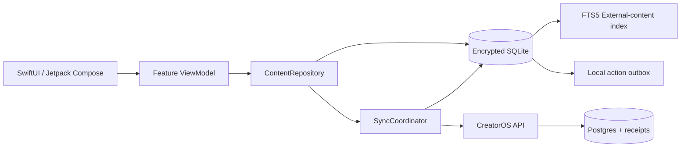
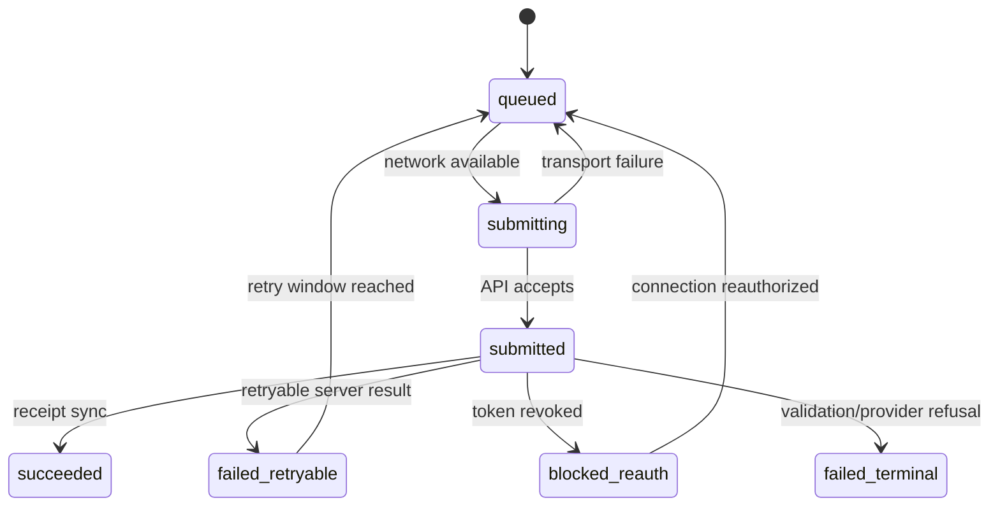
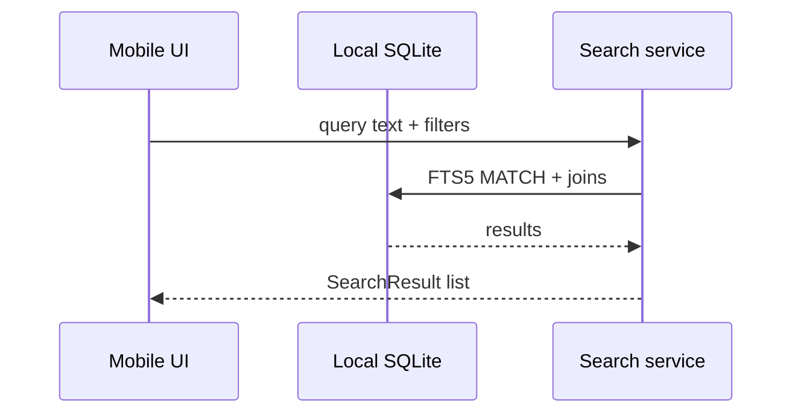

# TDD-01: Mobile Local Database & Search

- Status: In review
- Owner: Mobile Architect
- Reviewers: Product, Security, Backend
- Created: 2026-08-23
- Last updated: 2026-08-23
- Target release / feature flag: `creatoros.local_search.v1`
- Related PRD: `v2/creator_os_prd_v2.md`
- Related API: `v2/api/openapi/creatoros-public.openapi.yaml`
- Related architecture: `v2/architecture/ARCHITECTURE-03-data-layer-v2.md`
- ADRs: `v2/architecture/ARCHITECTURE-10-open-decisions-v2.md`

---

## 1. Decision Summary

### Problem

CreatorOS must provide fast, offline search over connected content metadata while remaining a local-first mobile application. The local database must be encrypted and must serve as the read source of truth for UI, while the backend remains authoritative for provider-synced metadata, receipts, and operation outcomes.

### Proposed Decision

Use a durable encrypted SQLite database on each platform:

- iOS: GRDB + SQLCipher + FTS5
- Android: Room + SQLCipher + FTS5

The local database stores only normalized metadata. It is not a cache—it is an encrypted read model plus command journal. Provider objects are normalized before persistence, and raw media or OAuth tokens are never stored locally.

The local FTS5 index is a derived, rebuildable projection. Canonical data lives in normal tables; FTS5 uses external-content mode with insert/update/delete triggers and soft-delete filtering.

### Goals

- Provide instant local search for offline and online states.
- Maintain consistent domain contracts across iOS and Android.
- Encrypt all local user data at rest.
- Reconcile local state from server cursors and receipts without data loss.
- Keep local search performance within NFR-01 budgets.

### Non-goals

- Storing raw provider media or raw provider payloads.
- Storing OAuth tokens or provider credentials.
- Building a general-purpose database backup system.
- Cross-platform shared database implementation; each platform uses native encrypted persistence.

### Acceptance Criteria

- Given a connected workspace with indexed records, when the user types a search query, local results appear within 100 ms p50 on mid-range devices.
- Given offline mode, when the user searches previously indexed content, results remain available.
- Given a soft-deleted remote record, when sync reconciles it, local search no longer returns it.
- Given a local command, when the user submits it, a pending operation and receipt are persisted atomically before network transport.
- Given an app process death after local enqueue, when the app restarts, pending operations remain discoverable and schedulable.
- Given database key loss, when the app starts, it triggers a fresh database creation and resync rather than silently corrupting existing data.
- Given FTS index corruption, when repair runs, it rebuilds from canonical `connected_record` and `search_content` without losing receipts or pending operations.

---

## 2. Context and Constraints

### Existing Architecture

CreatorOS uses native iOS and Android with a Node/TypeScript BFF and a dedicated connector worker. Mobile apps never call Google or Notion directly. The BFF accepts commands and returns operations/receipts. The local database must align with the BFF public contracts.

### Constraints

- **iOS:** GRDB DatabasePool with SQLCipher. Keychain stores the database key. Use `ThisDeviceOnly` accessibility.
- **Android:** Room with SQLCipher `SupportOpenHelperFactory`. Android Keystore/encrypted preferences wrap the key. Use WorkManager for persistent sync.
- **Network:** local reads never depend on connectivity.
- **Privacy:** only normalized metadata is persisted. Raw media is never uploaded or locally stored.
- **Provider:** provider object IDs are stable; titles/URLs are normalized.

### Assumptions

- SQLCipher build includes FTS5. Verified at startup and in CI.
- Local cursor values are opaque and server-issued.
- Local timestamps use integer epoch milliseconds.

---

## 3. Architecture and Ownership

### Context Diagram



### Component Responsibilities

| Component | Owns | Reads | Writes | Must not own |
|---|---|---|---|---|
| iOS app | UI state, encrypted cache, device outbox | local DB, public API | local DB, API commands | provider OAuth tokens |
| Android app | UI state, encrypted cache, device outbox | local DB, public API | local DB, API commands | provider OAuth tokens |
| ContentRepository | search queries, record projections | local DB | local DB | network sync |
| SyncCoordinator | cursor reconciliation, pending upload | local DB, API | local DB, API | provider execution |
| FTS trigger layer | derived search projection | canonical `connected_record` and `search_content` | FTS shadow tables | canonical data truth |

---

## 4. Domain and State Design

### Domain Objects

| Entity | Fields & Invariants | Owner | Persistence |
|---|---|---|---|
| `ContentRecord` | id, connectionId, provider, providerObjectId, recordType, title, normalizedText, canonicalUrl, authorName, timestamps, remoteVersion, isDeleted; unique `(connection_id, provider_object_id)` | API + mobile projection | local SQLite |
| `LocalOperation` | id, workspaceId, idempotencyKey, operationType, requestJson, requestHash, localStatus, serverOperationId, serverStatus, attemptCount, nextRetryAtMs, timestamps | Mobile | local SQLite |
| `ActionReceipt` | id, workspaceId, operationId, serverReceiptId, provider, providerActionId, status, resultJson, errorCode, errorMessage, occurredAtMs, receivedAtMs | API/Worker | local SQLite |
| `SyncState` | workspaceId, connectionId, streamName, cursor, syncStatus, lastAttemptAtMs, lastSuccessAtMs, lastErrorCode | Mobile | local SQLite |

### State Machines

#### Local operation



#### Connection health

```text
healthy -> syncing -> healthy
healthy -> degraded -> healthy
healthy -> reauth_required -> healthy (after reauth)
```

### Invariants

- A pending local operation is never lost after process death.
- A local receipt is preserved even if the provider object later disappears.
- FTS results always respect `is_deleted = 0`.
- A retry with the same idempotency key never creates a duplicate operation.
- Local reads never render raw remote responses directly.

---

## 5. End-to-End Data Flow

### Primary Sequence: Search



### Offline Command Submission

1. User confirms action.
2. App generates UUID operation ID and UUID idempotency key.
3. App inserts `LocalOperation` and pending `ActionReceipt` in one local transaction.
4. UI shows `queued`.
5. SyncCoordinator attempts upload.
6. On transport failure, status returns to `queued` with `next_retry_at_ms`.
7. On server acceptance, stores `server_operation_id`.
8. On receipt sync, updates local receipt and terminal state.

---

## 6. Persistence and Search Design

### 6.1 SQLite Schema

Use the schema below on both platforms. UUIDs are CreatorOS-generated TEXT primary keys.

```sql
PRAGMA foreign_keys = ON;
PRAGMA journal_mode = WAL;
PRAGMA synchronous = NORMAL;

CREATE TABLE workspaces (
    id TEXT PRIMARY KEY NOT NULL,
    display_name TEXT NOT NULL,
    updated_at_ms INTEGER NOT NULL
);

CREATE TABLE connections (
    id TEXT PRIMARY KEY NOT NULL,
    workspace_id TEXT NOT NULL REFERENCES workspaces(id) ON DELETE CASCADE,
    provider TEXT NOT NULL CHECK (provider IN ('google_drive', 'google_docs', 'google_calendar', 'notion')),
    provider_account_id TEXT,
    display_name TEXT,
    health_state TEXT NOT NULL CHECK (
        health_state IN ('healthy', 'syncing', 'degraded', 'reauth_required', 'disconnected')
    ),
    last_sync_at_ms INTEGER,
    last_success_at_ms INTEGER,
    last_error_code TEXT,
    last_error_message TEXT,
    updated_at_ms INTEGER NOT NULL,
    UNIQUE(workspace_id, provider, provider_account_id)
);

CREATE TABLE connected_record (
    id TEXT PRIMARY KEY NOT NULL,
    workspace_id TEXT NOT NULL REFERENCES workspaces(id) ON DELETE CASCADE,
    brand TEXT,
    campaign TEXT,
    title TEXT NOT NULL DEFAULT '',
    due_date_ms INTEGER,
    status TEXT NOT NULL DEFAULT 'draft' CHECK (
        status IN ('draft', 'scripting', 'filming', 'editing', 'ready', 'delivered', 'archived')
    ),
    delivery_status TEXT CHECK (
        delivery_status IS NULL OR delivery_status IN ('not_delivered', 'delivered', 'acknowledged', 'failed')
    ),
    next_action TEXT,
    next_action_reason TEXT,
    notes TEXT NOT NULL DEFAULT '',
    created_at_ms INTEGER NOT NULL,
    updated_at_ms INTEGER NOT NULL,
    is_deleted INTEGER NOT NULL DEFAULT 0 CHECK (is_deleted IN (0, 1))
);

CREATE INDEX connected_record_workspace_updated_idx
ON connected_record(workspace_id, is_deleted, updated_at_ms DESC);

CREATE INDEX connected_record_status_idx
ON connected_record(status);

CREATE TABLE sync_state (
    workspace_id TEXT NOT NULL REFERENCES workspaces(id) ON DELETE CASCADE,
    connection_id TEXT NOT NULL REFERENCES connections(id) ON DELETE CASCADE,
    stream_name TEXT NOT NULL,
    cursor TEXT,
    sync_status TEXT NOT NULL CHECK (
        sync_status IN ('idle', 'syncing', 'failed', 'requires_full_resync')
    ),
    last_attempt_at_ms INTEGER,
    last_success_at_ms INTEGER,
    last_error_code TEXT,
    updated_at_ms INTEGER NOT NULL,
    PRIMARY KEY (workspace_id, connection_id, stream_name)
);

CREATE TABLE local_operations (
    id TEXT PRIMARY KEY NOT NULL,
    workspace_id TEXT NOT NULL REFERENCES workspaces(id) ON DELETE CASCADE,
    idempotency_key TEXT NOT NULL,
    operation_type TEXT NOT NULL,
    request_json TEXT NOT NULL,
    request_hash TEXT NOT NULL,
    local_status TEXT NOT NULL CHECK (
        local_status IN (
            'queued', 'submitting', 'submitted', 'succeeded',
            'failed_retryable', 'failed_terminal', 'blocked_reauth', 'cancelled'
        )
    ),
    server_operation_id TEXT,
    server_status TEXT,
    attempt_count INTEGER NOT NULL DEFAULT 0,
    next_retry_at_ms INTEGER,
    created_at_ms INTEGER NOT NULL,
    updated_at_ms INTEGER NOT NULL,
    UNIQUE(workspace_id, idempotency_key)
);

CREATE INDEX local_operations_pending_idx
ON local_operations(local_status, next_retry_at_ms, created_at_ms);

CREATE TABLE action_receipts (
    id TEXT PRIMARY KEY NOT NULL,
    workspace_id TEXT NOT NULL REFERENCES workspaces(id) ON DELETE CASCADE,
    operation_id TEXT NOT NULL REFERENCES local_operations(id) ON DELETE CASCADE,
    server_receipt_id TEXT,
    provider TEXT,
    provider_action_id TEXT,
    status TEXT NOT NULL CHECK (
        status IN ('pending', 'succeeded', 'failed', 'cancelled')
    ),
    result_json TEXT,
    error_code TEXT,
    error_message TEXT,
    occurred_at_ms INTEGER NOT NULL,
    received_at_ms INTEGER NOT NULL,
    UNIQUE(operation_id, server_receipt_id)
);

CREATE INDEX action_receipts_operation_idx
ON action_receipts(operation_id, occurred_at_ms DESC);
```

### 6.2 FTS5 External-Content Table

```sql
CREATE TABLE external_source_link (
    id TEXT PRIMARY KEY NOT NULL,
    workspace_id TEXT NOT NULL REFERENCES workspaces(id) ON DELETE CASCADE,
    connected_record_id TEXT NOT NULL REFERENCES connected_record(id) ON DELETE CASCADE,
    connection_id TEXT NOT NULL REFERENCES connections(id),
    provider TEXT NOT NULL,
    external_object_id TEXT,
    canonical_url TEXT,
    display_name TEXT NOT NULL DEFAULT '',
    link_type TEXT NOT NULL CHECK (
        link_type IN ('brief', 'script', 'footage', 'design', 'edit', 'delivery', 'other')
    ),
    match_method TEXT CHECK (
        match_method IS NULL OR match_method IN ('explicit_url', 'object_id', 'metadata_match', 'user_confirmed')
    ),
    confidence REAL,
    status TEXT NOT NULL DEFAULT 'healthy' CHECK (
        status IN ('healthy', 'stale', 'missing', 'needs_reauthorization')
    ),
    last_verified_at_ms INTEGER,
    is_deleted INTEGER NOT NULL DEFAULT 0 CHECK (is_deleted IN (0, 1)),
    created_at_ms INTEGER NOT NULL,
    UNIQUE(connected_record_id, provider, external_object_id)
);

CREATE INDEX external_source_link_record_idx
ON external_source_link(connected_record_id, is_deleted);

CREATE VIRTUAL TABLE search_fts
USING fts5(
    title,
    brand,
    campaign,
    notes,
    next_action,
    display_name,
    provider,
    content='search_content',
    content_rowid='rowid',
    tokenize='unicode61 remove_diacritics 2',
    prefix='2 3',
    detail=column
);

CREATE TABLE search_content (
    rowid INTEGER PRIMARY KEY NOT NULL,
    entity_type TEXT NOT NULL CHECK (entity_type IN ('connected_record', 'external_source_link')),
    entity_id TEXT NOT NULL,
    workspace_id TEXT NOT NULL,
    title TEXT NOT NULL DEFAULT '',
    brand TEXT NOT NULL DEFAULT '',
    campaign TEXT NOT NULL DEFAULT '',
    notes TEXT NOT NULL DEFAULT '',
    next_action TEXT NOT NULL DEFAULT '',
    display_name TEXT NOT NULL DEFAULT '',
    provider TEXT NOT NULL DEFAULT '',
    updated_at_ms INTEGER NOT NULL DEFAULT 0
);
```

### 6.3 FTS Triggers

Use the trigger set below exactly. It handles insert, delete, and update with soft-delete filtering.

```sql
CREATE TRIGGER search_content_cr_ai
AFTER INSERT ON connected_record
WHEN NEW.is_deleted = 0
BEGIN
    INSERT INTO search_content(rowid, entity_type, entity_id, workspace_id, title, brand, campaign, notes, next_action, display_name, provider, updated_at_ms)
    VALUES (NEW.rowid, 'connected_record', NEW.id, NEW.workspace_id, NEW.title, COALESCE(NEW.brand,''), COALESCE(NEW.campaign,''), COALESCE(NEW.notes,''), COALESCE(NEW.next_action,''), '', '', NEW.updated_at_ms);
END;

CREATE TRIGGER search_content_cr_au
AFTER UPDATE OF title, brand, campaign, notes, next_action, is_deleted
ON connected_record
BEGIN
    DELETE FROM search_content WHERE entity_type='connected_record' AND entity_id=OLD.id;

    INSERT INTO search_content(rowid, entity_type, entity_id, workspace_id, title, brand, campaign, notes, next_action, display_name, provider, updated_at_ms)
    SELECT NEW.rowid, 'connected_record', NEW.id, NEW.workspace_id, NEW.title, COALESCE(NEW.brand,''), COALESCE(NEW.campaign,''), COALESCE(NEW.notes,''), COALESCE(NEW.next_action,''), '', '', NEW.updated_at_ms
    WHERE NEW.is_deleted = 0;
END;

CREATE TRIGGER search_content_esl_ai
AFTER INSERT ON external_source_link
WHEN NEW.is_deleted = 0
BEGIN
    INSERT INTO search_content(rowid, entity_type, entity_id, workspace_id, title, brand, campaign, notes, next_action, display_name, provider, updated_at_ms)
    VALUES (
        NULL,
        'external_source_link', NEW.id, NEW.workspace_id,
        '', '', '', '', '',
        COALESCE(NEW.display_name,''), COALESCE(NEW.provider,''),
        COALESCE(NEW.last_verified_at_ms, 0)
    );
END;

CREATE TRIGGER search_content_esl_ad
AFTER DELETE ON external_source_link
BEGIN
    DELETE FROM search_content WHERE entity_type='external_source_link' AND entity_id=OLD.id;
END;
```

### 6.4 Search Query

Both platforms use the same domain query. Use `bm25()` with field weighting across record and source-link entries.

```sql
SELECT
    sc.entity_type,
    sc.entity_id,
    c.title,
    sc.display_name AS matched_source_display_name,
    c.updated_at_ms,
    snippet(search_fts, 1, '<mark>', '</mark>', '…', 14) AS highlighted_title,
    bm25(search_fts, 8.0, 4.0, 4.0, 2.0, 2.0, 3.0, 1.0) AS rank
FROM search_fts
JOIN search_content AS sc
  ON sc.rowid = search_fts.rowid
LEFT JOIN connected_record AS c
  ON sc.entity_type = 'connected_record' AND c.id = sc.entity_id AND c.workspace_id = :workspaceId
WHERE search_fts MATCH :ftsQuery
  AND c.workspace_id = :workspaceId
  AND c.is_deleted = 0
ORDER BY rank ASC, c.modified_at_ms DESC, c.id ASC
LIMIT :limit;
```

### 6.5 Query Compiler Policy

- Default AND semantics for multi-word queries.
- Prefix matching allowed only for queries with 3+ normalized characters.
- Empty query bypasses FTS and returns recent records.
- Invalid syntax escapes to literal tokens.
- Query length/term/result limits enforced.
- Structured filters: provider, record type, connection, date range, health state.

---

## 7. Platform Implementation

### 7.1 iOS — GRDB + SQLCipher

Module structure:

```text
apps/ios/CreatorOS/
├── Core/Database/
│   ├── DatabaseManager.swift
│   ├── DatabaseKeyProvider.swift
│   ├── CreatorOSDatabaseMigrator.swift
│   ├── DatabaseIntegrityChecker.swift
│   └── DatabaseError.swift
├── Domain/Content/
│   ├── ContentRecord.swift
│   ├── ContentRepository.swift
│   └── SearchQuery.swift
├── Data/Content/
│   ├── ContentRecordRow.swift
│   ├── ContentSearchStore.swift
│   └── ContentRepositoryGRDB.swift
└── Features/Search/
    ├── SearchView.swift
    └── SearchViewModel.swift
```

Key requirements:

- Use `DatabasePool` for concurrent reads and serialized writes.
- Configure SQLCipher passphrase before migration.
- Store DB key in Keychain with `.afterFirstUnlockThisDeviceOnly`.
- Run migrations with `DatabaseMigrator`.
- Expose search results through `ValueObservation`.
- Perform FTS rebuild only in a controlled maintenance path.

### 7.2 Android — Room + SQLCipher

Module structure:

```text
apps/android/app/src/main/java/com/creatoros/
├── core/database/
│   ├── CreatorOSDatabase.kt
│   ├── DatabaseFactory.kt
│   ├── DatabaseKeyProvider.kt
│   ├── CreatorOSMigrations.kt
│   └── DatabaseHealthChecker.kt
├── data/content/
│   ├── ContentRecordEntity.kt
│   ├── ContentSearchDao.kt
│   ├── ContentRecordDao.kt
│   └── RoomContentRepository.kt
├── domain/content/
│   ├── ContentRepository.kt
│   ├── SearchQuery.kt
│   └── SearchResult.kt
└── feature/search/
    ├── SearchScreen.kt
    └── SearchViewModel.kt
```

Key requirements:

- Use Room entities for canonical tables.
- Use manual SQL DDL for FTS5 external-content table and triggers.
- Use SQLCipher `SupportOpenHelperFactory`.
- Store DB key in Keystore-backed encrypted preferences.
- Use `Flow` for observable search.
- Use `withTransaction` for operation + receipt insertion.

---

## 8. Migration and Backup

### 8.1 Migration Rules

- Explicit migration chains from every supported schema version.
- FTS rebuild separate from schema version.
- Preserve `local_operations` and `action_receipts` data.
- Run migrations transactionally.
- Test migrations against encrypted fixtures.

### 8.2 Backup Policy

- Local database is not a primary backup.
- Backend is authoritative for normalized metadata, operations, receipts.
- No user-facing DB backup by default.
- No cloud backup of SQLCipher key and database together.
- If a controlled diagnostic backup exists, use database-aware backup APIs, not raw file copy during WAL.

---

## 9. Failure, Security, and Recovery

### 9.1 Error Taxonomy

| Category | Example | Retry? | User Message |
|---|---|---|---|
| Network transient | timeout | yes | Will retry when connected |
| OAuth invalid | invalid_grant | no | Reconnect provider |
| Provider quota | 429 | provider-aware | Sync delayed |
| Validation | unsupported action | no | Action not supported |
| Database integrity | FTS mismatch | no | Search updating |

### 9.2 Security and Privacy

- Raw media never stored.
- OAuth tokens never stored.
- `normalized_text` is policy-approved only.
- Database key never logged.
- No raw provider payload in local DB.

---

## 10. Observability

### Telemetry fields

```text
db_schema_version
fts_index_version
fts_rebuild_duration_ms
search_query_length
search_result_count
search_latency_ms
sync_connection_id
sync_cursor_age_ms
operation_id
idempotency_key_hash
receipt_status
database_open_failure_code
database_integrity_failure_code
```

Do not log:

- Search text or normalized text.
- OAuth state.
- Raw API payloads.
- SQLCipher keys.
- Receipt content that may include user data.

---

## 11. Test Strategy

### 11.1 Testable Invariants

| Invariant | Test Method |
|---|---|
| FTS returns non-deleted records only | Insert/update/delete + search |
| Local operation persists with receipt atomically | Transaction kill test |
| Same idempotency key returns original operation | Duplicate submission |
| FTS rebuild restores equivalent search results | Desync + rebuild |
| DB opens only with correct key | Key mismatch test |
| Pending operations survive process death | Process kill + relaunch |

### 11.2 Test Matrix

| Layer | iOS | Android |
|---|---|---|
| Schema/migration | GRDB migration tests | Room MigrationTestHelper |
| FTS triggers | SQL integration | SQL integration |
| Search | Query compiler + ranking | Same |
| Outbox atomicity | Repository tests | withTransaction tests |
| Sync cursor | Fake API cursor pages | Same |
| Encryption | Open succeeds/fails with key | Same |
| Recovery | Kill/reopen during sync | Process death + WorkManager |
| Index repair | Desync + rebuild | Desync + rebuild |

---

## 12. Open Questions

| Question | Owner | Default |
|---|---|---|
| Should `normalized_text` be truncated at 200k chars? | Mobile Architect | Yes |
| Should prefix matching be enabled by default? | Product | Yes, 3+ chars only |
| Should multiple provider accounts share FTS index? | Backend + Mobile | Yes, shared workspace index |
| Should FTS rebuild be manual or automatic? | Mobile Architect | Automatic on integrity failure |

---

## 13. Change Log

| Version | Date | Summary |
|---|---|---|
| 1.0 | 2026-08-23 | Created Mobile Local Database & Search TDD. |
